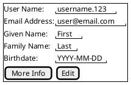

# Requirements Document - User Profile

## Summary

This is a collection of the requirements for an application User Profile.

## Use Cases 

```plantuml
User --> (Update Profile)
User --> (Change Password)
User --> (Login)
User --> (View Roles)

Admin --> (Update Selected User Profile)
Admin --> (Update Selected User Password)
Admin --> (Manage Selected User Roles)

User <|-- Admin
```

## Required Permissions

| Role            | Right               | Functionality                                   | Permission Key                      |
|:----------------|:--------------------|:------------------------------------------------|:------------------------------------|
| User Management | Reset User Password | Directed reset of user password                 | UserManagement::ResetUserPassword   |
| User Management | Manage Profile      | Directed user profile editing                   | UserManagement::ManageProfile       |
| Users           | Authenticated       | General right showing current user is logged in | Users::Authenticated                |
| Users           | Edit Profile        | Permissions to edit users own profile           | Users::EditProfile                  |


## Wireframes



## Entities

### User Profile

```plantuml
class User {
   -UserId : guid
   +FirstName : string
   +LastName : string
   +EmailAddress : string
   +User : string
   +Birthdate : Date
   +UserName : string
   +ExternalAccountLink : string
}

class Contact {
   +UserId : guid
   +Type : ContactTypes
   +Value : string
}

enum ContactTypes {
    Email
    CellPhone
    HomePhone
    WorkPhone
    HomeAddress
    OfficeAddress
}

User o- Contact
Contact *- ContactTypes
```

