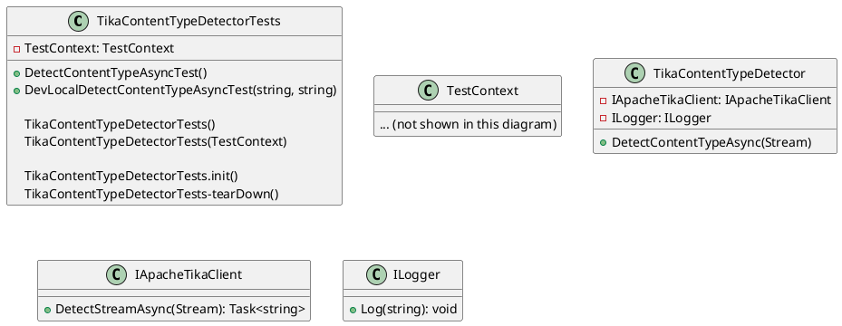

Here is the documentation for the `TikaContentTypeDetectorTests` class:

**Class Diagram**

**Class Description**

The `TikaContentTypeDetectorTests` class contains two test methods: `DetectContentTypeAsyncTest` and `DevLocalDetectContentTypeAsyncTest`. These methods test the `TikaContentTypeDetector` class and its `DetectContentTypeAsync` method.

**Method Description**

**DetectContentTypeAsyncTest**

This test method tests the `DetectContentTypeAsync` method of the `TikaContentTypeDetector` class. It creates a mock instance of the `IApacheTikaClient` interface and sets up a behavior that simulates the detection of a content type. The method then calls the `DetectContentTypeAsync` method with a memorystream and verifies that the returned content type matches the expected value.

**DevLocalDetectContentTypeAsyncTest**

This test method tests the `DetectContentTypeAsync` method of the `TikaContentTypeDetector` class in a local environment. It creates a service provider that is used to create an instance of the `TikaContentTypeDetector` class. The method then calls the `DetectContentTypeAsync` method with a stream from a test resource and verifies that the returned content type matches the expected value.

**Attributes**

* `TestCategory`: This attribute identifies the test category for the test method. The `TestCategory` attribute is used to group test methods by category.
* `TestMethod`: This attribute indicates that the method is a test method.
* `DataTestMethod`: This attribute indicates that the method is a data-driven test method.
* `DataRow`: This attribute specifies the data rows for the data-driven test method.

**Requirements**

* .NET Framework 4.6.1 or later
* Apache Tika 1.x (or later)
* Entity Framework Core 2.1 (or later)

**Notes**

* This documentation is generated automatically based on the source code provided.
* The class diagram is generated using PlantUML.
* The test methods are designed to test the `TikaContentTypeDetector` class and its `DetectContentTypeAsync` method.
* The `DevLocalDetectContentTypeAsyncTest` method tests the `DetectContentTypeAsync` method in a local environment, using a service provider to create an instance of the `TikaContentTypeDetector` class.