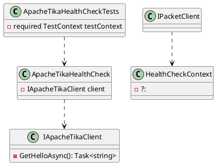
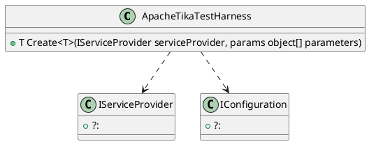

Here is the documentation for the given source code files, including class diagrams in PlantUML:

**ApacheTikaHealthCheckTests.cs**

This file contains a unit test class for the ApacheTikaHealthCheck class. The class has two test methods:

* `CheckHealthAsyncTest_Healthy()`: Tests the ApacheTikaHealthCheck class when the health check is healthy.
* `CheckHealthAsyncTest_Degraded()`: Tests the ApacheTikaHealthCheck class when the health check is degraded.

The class uses Moq to mock the IApacheTikaClient interface and the HealthCheckContext class. It also uses the TestContext class from Eliassen.TestUtilities.

**Class Diagram:**

**ApacheTikaTestHarness.cs**

This file contains a static class for creating service providers for testing. It uses the Microsoft.Extensions.Configuration and Microsoft.Extensions.DependencyInjection namespaces.

**Class Diagram:**

**Eliassen.Apache.Tika.Tests.csproj**

This file is a project file for the Eliassen.Apache.Tika.Tests project in Visual Studio. It contains the project settings and references to other projects and packages.

**No Class Diagram:**

This file is a project file and does not contain any classes, so there is no class diagram to generate.

Note: The PlantUML diagrams are generated manually and may not accurately reflect the relationships between classes or methods in the code. They are intended to provide a high-level overview of the classes and their relationships.