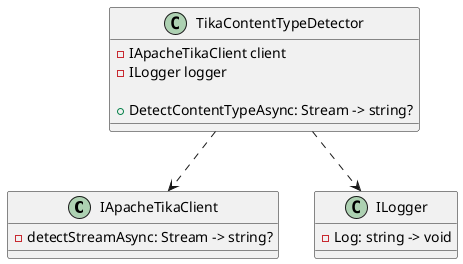

Here is the documentation for the `TikaContentTypeDetector` class:

**Class Diagram in PlantUML**

**Class Description**

The `TikaContentTypeDetector` class is responsible for detecting the content type of a stream using Apache Tika. It provides an asynchronous method `DetectContentTypeAsync` that takes a `Stream` object as input and returns a `string?` (nullable string) representing the detected content type.

**Method Documentation**

### `DetectContentTypeAsync(Stream source)`

Asynchronously detects the content type of the provided stream using Apache Tika.

**Parameters**

* `source`: The stream whose content type needs to be detected.

**Return Value**

* A `Task<string?>` representing the asynchronous operation. The task result contains the detected content type as a string, or `null` if the content type cannot be determined.

**Dependencies**

* `IApacheTikaClient`: An instance of the Apache Tika client is required to perform the content type detection.
* `ILogger`: An instance of the logger is used to log any errors or warnings during the content type detection process.

**Notes**

* The `DetectContentTypeAsync` method does not handle any exceptions that may occur during the content type detection process. The caller is responsible for handling any exceptions that may be thrown.