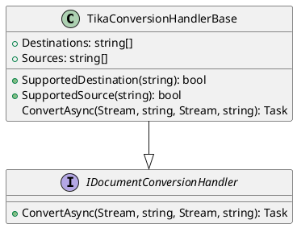
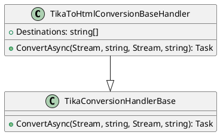
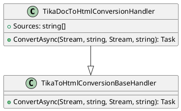
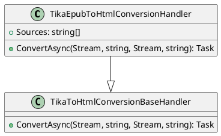
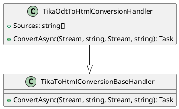
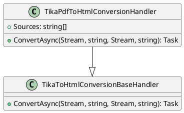

Here is the documentation for the provided source code files, including class diagrams in Plant UML.

**TikaConversionHandlerBase.cs**

This is an abstract class that provides a base implementation for document conversion handlers using Apache Tika. It defines the interface for converting documents from a source format to a destination format.

**TikaToHtmlConversionBaseHandler.cs**

This is an abstract class that provides a base implementation for handlers that convert documents to HTML using Apache Tika. It inherits from `TikaConversionHandlerBase` and provides a default implementation for converting documents to HTML.

**TikaDocToHtmlConversionHandler.cs**

This is a concrete class that provides a handler for converting Microsoft Word documents to HTML using Apache Tika. It inherits from `TikaToHtmlConversionBaseHandler` and provides a specific implementation for converting Microsoft Word documents to HTML.

**TikaDocxToHtmlConversionHandler.cs**

This is a concrete class that provides a handler for converting Microsoft Word (DOCX) documents to HTML using Apache Tika. It inherits from `TikaToHtmlConversionBaseHandler` and provides a specific implementation for converting Microsoft Word (DOCX) documents to HTML.

**TikaEpubToHtmlConversionHandler.cs**

This is a concrete class that provides a handler for converting EPUB files to HTML using Apache Tika. It inherits from `TikaToHtmlConversionBaseHandler` and provides a specific implementation for converting EPUB files to HTML.

**TikaOdtToHtmlConversionHandler.cs**

This is a concrete class that provides a handler for converting OpenDocument Text (ODT) documents to HTML using Apache Tika. It inherits from `TikaToHtmlConversionBaseHandler` and provides a specific implementation for converting OpenDocument Text (ODT) documents to HTML.

**TikaPdfToHtmlConversionHandler.cs**

This is a concrete class that provides a handler for converting PDF documents to HTML using Apache Tika. It inherits from `TikaToHtmlConversionBaseHandler` and provides a specific implementation for converting PDF documents to HTML.

