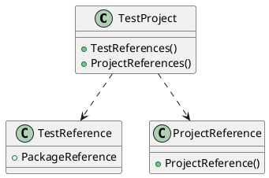

Here is the documentation for the specified csproj file:

**Project:** Eliassen.Azure.StorageAccount.Tests

**Overview:**

This project is a test project for the Eliassen.Azure.StorageAccount library. It is built using the .NET 8.0 framework and uses the MSTest test framework for unit testing. The project includes references to the Microsoft.NET.Test.Sdk, MSTest.TestAdapter, MSTest.TestFramework, and coverlet.collector packages.

**Class Diagram (in PlantUML format):**

**Class Description:**

* **TestProject**: The test project class contains references to the test packages and project references.
* **TestReference**: Represents a package reference to a test package (e.g. Microsoft.NET.Test.Sdk, MSTest.TestAdapter, etc.).
* **ProjectReference**: Represents a project reference to another project in the solution (e.g. Eliassen.Azure.StorageAccount, Eliassen.TestUtilities, etc.).

**Properties and Methods:**

* **TestReferences()**: A collection of package references to test packages.
* **ProjectReferences()**: A collection of project references to other projects in the solution.
* **PackageReference**: A property that represents a package reference (e.g. Microsoft.NET.Test.Sdk).
* **ProjectReference()**: A property that represents a project reference (e.g. Eliassen.Azure.StorageAccount).

**Target Framework:** .NET 8.0

**Implicit Usings:** False

**Nullable:** Enabled

**IsPackable:** False

**IsTestProject:** True

I hope this documentation meets your requirements! Let me know if you need any further clarification.