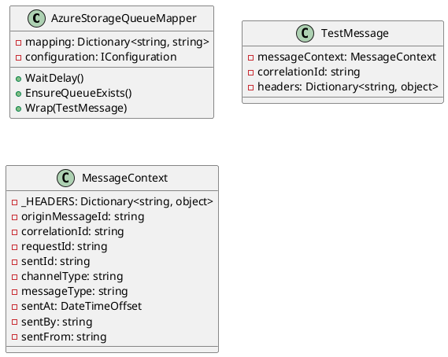
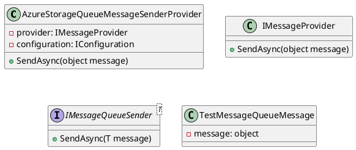

Here is the documentation for the provided source code files, including class diagrams in PlantUML.

**AzureStorageQueueMapperTests.cs**

This unit test class tests the `AzureStorageQueueMapper` class, which is responsible for mapping Azure Storage queue settings to configuration settings.

### Class Diagram

### Tests

* `WaitDelayTest`: Tests the `WaitDelay` method of the `AzureStorageQueueMapper` class, which returns the delay value based on the configuration setting.
* `EnsureQueueExistsTest`: Tests the `EnsureQueueExists` method of the `AzureStorageQueueMapper` class, which returns a boolean value indicating whether the queue exists based on the configuration setting.
* `WrapTest`: Tests the `Wrap` method of the `AzureStorageQueueMapper` class, which converts a `TestMessage` object to a wrapped message with `MessageContext` information.

**AzureStorageQueueMessageSenderProviderTests.cs**

This unit test class tests the `AzureStorageQueueMessageSenderProvider` class, which is responsible for sending messages to Azure Storage queues.

### Class Diagram

### Tests

* `SendAsyncTest_ByFullType`: Tests the `SendAsync` method of the `AzureStorageQueueMessageSenderProvider` class, which sends a message to an Azure Storage queue using the full type name.
* `SendAsyncTest_ByKeyed`: Tests the `SendAsync` method of the `AzureStorageQueueMessageSenderProvider` class, which sends a message to an Azure Storage queue using the keyed type name.
* `FindProviderTests`: Tests the `FindProvider` method of the `AzureStorageQueueMessageSenderProvider` class, which returns a list of providers based on the configuration setting.

Note that the class diagrams are simplified and do not include all the methods and properties of the classes. They are intended to provide a high-level overview of the classes and their relationships.