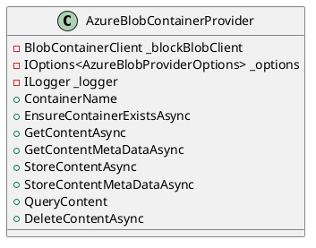
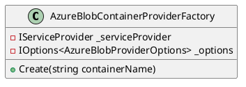
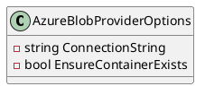
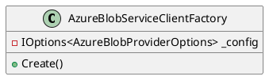
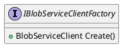

Here is the documentation for the provided source code files, including class diagrams in PlantUML:

**AzureBlobContainerProvider.cs**

**Class Diagram:**

**Description:**

The `AzureBlobContainerProvider` class represents a provider for storing and searching content in Azure Blob storage. It uses the `Azure.Storage.Blobs` NuGet package to interact with the Azure Blob storage service.

**Methods:**

* `EnsureContainerExistsAsync`: Ensures that the container exists in Azure Blob storage.
* `GetContentAsync`: Retrieves the content of a file from Azure Blob storage.
* `GetContentMetaDataAsync`: Retrieves metadata for a file in Azure Blob storage.
* `StoreContentAsync`: Stores a file in Azure Blob storage.
* `StoreContentMetaDataAsync`: Stores metadata for a file in Azure Blob storage.
* `QueryContent`: Queries the metadata for all files in Azure Blob storage.
* `DeleteContentAsync`: Deletes a file from Azure Blob storage.

**AzureBlobContainerProviderFactory.cs**

**Class Diagram:**

**Description:**

The `AzureBlobContainerProviderFactory` class represents a factory for creating instances of `AzureBlobContainerProvider`. It uses the `IServiceProvider` and `IOptions<AzureBlobProviderOptions>` interfaces to create an instance of `AzureBlobContainerProvider`.

**Method:**

* `Create(string containerName)`: Creates a new instance of `AzureBlobContainerProvider` based on the specified collection name.

**AzureBlobProviderOptions.cs**

**Class Diagram:**

**Description:**

The `AzureBlobProviderOptions` class represents options for configuring Azure Blob storage provider. It contains two properties:
* `ConnectionString`: The connection string for Azure Blob storage.
* `EnsureContainerExists`: If true, the system will create a container if it does not exist.

**AzureBlobServiceClientFactory.cs**

**Class Diagram:**

**Description:**

The `AzureBlobServiceClientFactory` class represents a factory for creating instances of `BlobServiceClient`. It uses the `IOptions<AzureBlobProviderOptions>` interface to create an instance of `BlobServiceClient`.

**Method:**

* `Create()`: Creates a new instance of `BlobServiceClient`.

**IBlobServiceClientFactory.cs**

**Class Diagram:**

**Description:**

The `IBlobServiceClientFactory` interface represents a factory that creates instances of `BlobServiceClient`.

**Methods:**

* `Create()`: Creates a new instance of `BlobServiceClient`.