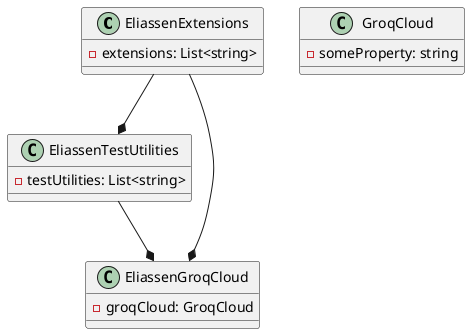

Here is the documentation for the provided source code files:

**Project Documentation**

The provided project file, `Eliassen.GroqCloud.Tests.csproj`, is a test project for the Eliassen GroqCloud project. It is a .NET 8.0 project and uses the Microsoft.NET.Test.Sdk and MSTest.TestAdapter packages for testing.

**Properties**

The project has the following properties:

* `TargetFramework`: set to `net8.0`, indicating that the project targets .NET 8.0.
* `ImplicitUsings`: set to `false`, indicating that implicit usings are not allowed.
* `Nullable`: set to `enable`, indicating that nullable reference types are enabled.
* `IsPackable`: set to `false`, indicating that the project is not packable.
* `IsTestProject`: set to `true`, indicating that this is a test project.

**Package References**

The project references the following packages:

* `coverlet.collector`: version 6.0.2, for collecting test coverage data.
* `Microsoft.NET.Test.Sdk`: version 17.10.0, for testing framework.
* `MSTest.TestAdapter`: version 3.4.3, for test adapter.
* `MSTest.TestFramework`: version 3.4.3, for test framework.

**Project References**

The project references the following projects:

* `Eliassen.Extensions`: from the `Framework` directory, for shared extensions.
* `Eliassen.TestUtilities`: from the `Framework` directory, for test utilities.
* `Eliassen.GroqCloud`: from the same directory, for the Eliassen GroqCloud project.

**Class Diagram (PlantUML)**

Here is the class diagram for the project:

This diagram shows the relationships between the classes in the project. Note that this is a simplified representation and may not capture all the complexity of the actual code.