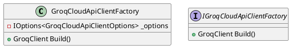
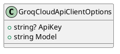
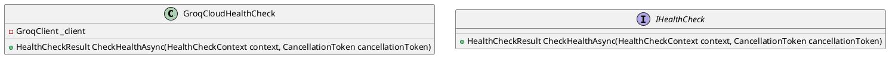
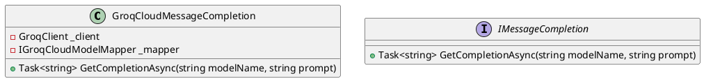
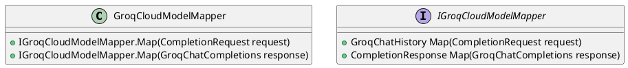
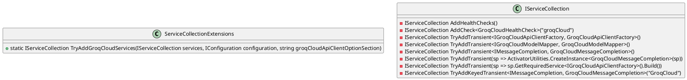

Here is the documentation for the given source code files, including class diagrams in PlantUML:

**Class Diagrams:**

First, let's create the class diagrams for the given source code files. We can use PlantUML to create these diagrams.

GroqCloudApiClientFactory:

GroqCloudApiClientOptions:

GroqCloudHealthCheck:

GroqCloudMessageCompletion:

GroqCloudModelMapper:

ServiceCollectionExtensions:

**Documentation:**

Here is the documentation for the given source code files:
```markdown
**GroqCloudApiClientFactory**

The `GroqCloudApiClientFactory` class is responsible for creating instances of the `GroqCloudApiClient`. It takes an instance of `IOptions<GroqCloudApiClientOptions>` in its constructor and provides a `Build` method that returns a new instance of the `GroqCloudApiClient`.

**GroqCloudApiClientOptions**

The `GroqCloudApiClientOptions` class represents the configurable options for the `GroqCloudApiClient`. It has two properties: `ApiKey` and `Model`, which represent the API key and model name for the `GroqCloudApiClient`, respectively.

**GroqCloudHealthCheck**

The `GroqCloudHealthCheck` class is responsible for checking the health of the `GroqCloudApiClient`. It takes an instance of `GroqClient` in its constructor and provides a `CheckHealthAsync` method that returns a `HealthCheckResult` indicating the health status of the `GroqCloudApiClient`.

**GroqCloudMessageCompletion**

The `GroqCloudMessageCompletion` class is responsible for generating message completions using the `GroqCloudApiClient`. It takes instances of `GroqClient` and `IGroqCloudModelMapper` in its constructor and provides a `GetCompletionAsync` method that returns a `Task<string>` representing the computed completion.

**GroqCloudModelMapper**

The `GroqCloudModelMapper` class is responsible for mapping `CompletionRequest` objects to `GroqChatHistory` objects and vice versa. It implements the `IGroqCloudModelMapper` interface and provides two methods: `Map` and `Map`, which perform the mapping.

**ServiceCollectionExtensions**

The `ServiceCollectionExtensions` class provides extension methods for configuring services related to `GroqCloud`. It provides a `TryAddGroqCloudServices` method that configures services for `GroqCloud` and adds instances of `IGroqCloudApiClient