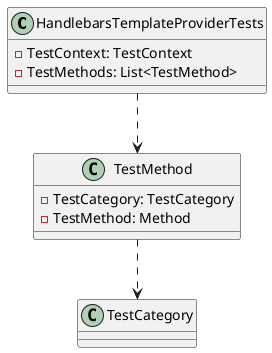

Here is the documentation for the `HandlebarsTemplateProviderTests` class in C#:

**Class Diagram:**

**Class Description:**
The `HandlebarsTemplateProviderTests` class is a set of unit tests for the `HandlebarsTemplateProvider` class. It contains a collection of test methods that cover different scenarios for applying Handlebars templates.

**Test Methods:**

1. `ApplyAsyncTest_Simple`: Tests the basic functionality of applying a Handlebars template.
2. `ApplyAsyncTest_WithDate`: Tests the functionality of applying a Handlebars template with a date helper.
3. `ApplyAsyncTest_WithDateAndFormat`: Tests the functionality of applying a Handlebars template with a date helper and a format string.
4. `ApplyAsyncTest_WithGuid`: Tests the functionality of applying a Handlebars template with a GUID helper.
5. `ApplyAsyncTest_WithHash`: Tests the functionality of applying a Handlebars template with a hash helper.
6. `ApplyAsyncTest_WithGetSet`: Tests the functionality of applying a Handlebars template with a get-set helper.
7. `ApplyAsyncTest_WithStringReplace`: Tests the functionality of applying a Handlebars template with a string replace helper.

**Test Context:**
The `TestContext` object is used to store test-related information, such as the name of the test method and any test-specific settings.

**Test Methods:**
The `TestMethod` object represents a single test method in the `HandlebarsTemplateProviderTests` class. Each test method contains a set of test-specific settings and assertions.

**TestCategory:**
The `TestCategory` property specifies the category of the test method (e.g., "Unit" or "Integration"). This property is used to group test methods by category.

**TestMethod:**
The `TestMethod` property represents the actual test method that is executed. This property is an instance of the `TestMethod` class, which contains the test-specific code and assertions.

Note: The PlantUML code above represents a simple class diagram, which shows the relationships between the `HandlebarsTemplateProviderTests` class, `TestMethod` class, and `TestCategory` class. The diagram is not exhaustive, but it gives an idea of the main classes and relationships involved.