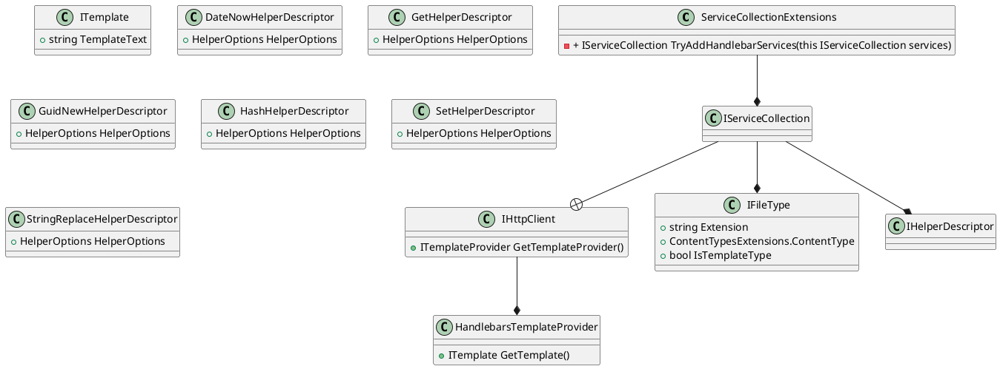

Here is the documentation for the provided source code files, including class diagrams in Plant UML:

**Eliassen.Handlebars.csproj**

This is a .NET Core project file that defines the settings and dependencies for the Eliassen.Handlebars NuGet package.

* **Properties**:
	+ `TargetFramework`: The target framework for the project, set to `net8.0`.
	+ `ImplicitUsings`: Set to `false` to disable implicit usings.
	+ `Nullable`: Enables nullable reference types.
	+ `GenerateDocumentationFile`: Set to `True` to generate XML documentation files.
	+ `GenerateAssemblyInfo`: Set to `True` to generate assembly information files.
	+ `PackageReadmeFile`: Set to `Readme.Handlebars.md` to specify the README file for the package.

**Readme.Handlebars.md**

This is the README file for the Eliassen.Handlebars NuGet package.

* **Summary**: This extension adds templating support for Handlebars.Net.
* **Notes and References**:
	+ GitHub repositories for Handlebars.Net and Handlebars.Net.Extension.Json.

**ServiceCollectionExtensions.cs**

This is a static class that provides extension methods for configuring services related to Handlebars templates in the `IServiceCollection`.

* **Namespace**: Eliassen.Handlebars

**Class Diagram (Plant UML)**:
