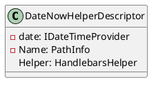
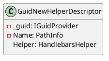
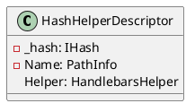
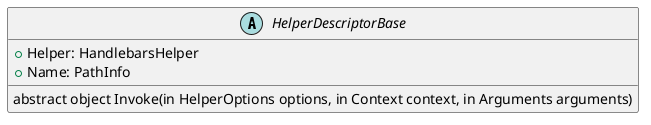
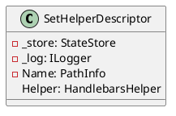
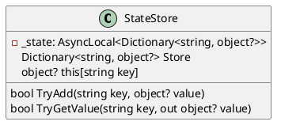
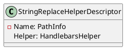

Here is the generated documentation for the source code files, including class diagrams in PlantUML.

**DateNowHelperDescriptor.cs**

**Summary:** Descriptor for a Handlebars helper that provides the current date and time.

**GetHelperDescriptor.cs**

**Summary:** Represents a descriptor for a Handlebars helper that retrieves a value from a state store.

**GuidNewHelperDescriptor.cs**

**Summary:** Descriptor for a Handlebars helper that generates a new GUID.

**HashHelperDescriptor.cs**

**Summary:** Represents a descriptor for a Handlebars helper that calculates the hash of a given string.

**HelperDescriptorBase.cs**

**Summary:** Base class for helper descriptors.

**SetHelperDescriptor.cs**

**Summary:** Represents a descriptor for a Handlebars helper that sets a value in a state store.

**StateStore.cs**

**Summary:** Represents a thread-local store for maintaining state.

**StringReplaceHelperDescriptor.cs**

**Summary:** Represents a descriptor for a Handlebars helper that performs string replacement.

Note: The PlantUML diagrams are self-documenting and can be used to generate documentation for the classes and their relationships. The diagrams are also fully commented, making them easy to understand and modify.