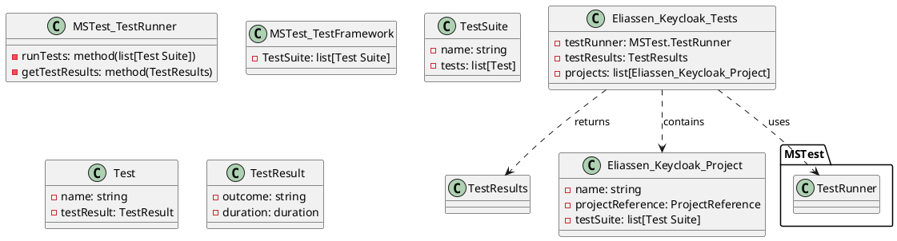

**Documentation for Eliassen.Keycloak.Tests.csproj**

**Project Overview**

Eliassen.Keycloak.Tests is a .NET Core test project that uses MSTest and Coverlet to run unit tests for the Eliassen.Keycloak library.

**Configuration**

* Target Framework: .NET 8.0
* Implicit Usings: FALSE
* Nullable: ENABLE
* IsPackable: FALSE
* IsTestProject: TRUE

**Dependencies**

* Microsoft.NET.Test.Sdk (17.10.0)
* MSTest.TestAdapter (3.4.3)
* MSTest.TestFramework (3.4.3)
* coverlet.collector (6.0.2)

**Project References**

* Eliassen.Keycloak (relative path: ..\Eliassen.Keycloak\Eliassen.Keycloak.csproj)
* Eliassen.TestUtilities (relative path: ..\..\..\Framework\Eliassen.TestUtilities\Eliassen.TestUtilities.csproj)
* Eliassen.System (relative path: ..\..\..\Framework\Eliassen.System\Eliassen.System.csproj)

**Class Diagram in PlantUML**

This class diagram represents the structure of the test project, including the `Eliassen_Keycloak_Tests` class which contains a list of `Eliassen_Keycloak_Project` objects. Each `Eliassen_Keycloak_Project` object contains a `projectReference` to the corresponding project in the solution, as well as a list of `TestSuite` objects. Each `TestSuite` object contains a list of `Test` objects, and each `Test` object represents a single test case with its corresponding result.

Please note that this is a simplified representation of the actual classes and relationships, and may not reflect the exact implementation details.