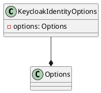

Here is the documentation for the provided source code files:

**Class Diagram for KeycloakIdentityOptions**

**Class Documentation**

### KeycloakIdentityOptions

Represents the options for configuring Keycloak identity.

**Properties**

* None

**Methods**

* None

###ManageKeycloakUser

Manages user operations in Keycloak for both graph and identity aspects.

** Constructors**

* `ManageKeycloakUser(ILogger<ManageKeycloakUser> log, IOptions<KeycloakIdentityOptions> config)`

**Properties**

* `_log`: The logger for logging purposes
* `config`: The configuration options for Keycloak identity

**Methods**

### CreateIdentityUserAsync

Creates a new identity user asynchronously with the specified details.

* `public Task<(string objectId, string? password)> CreateIdentityUserAsync(string email, string firstName, string lastName)`
	+ Creates a new identity user in Keycloak with the specified email, first name, and last name.
	+ Returns a task that represents the asynchronous operation. The task result contains the object ID and an optional password for the created user.

### GetIdentityUsersByEmail

Retrieves a list of user identity models based on the specified email address.

* `public Task<List<UserIdentityModel>?> GetIdentityUsersByEmail(string emailAddress)`
	+ Retrieves a list of user identity models from Keycloak based on the specified email address.
	+ Returns a task that represents the asynchronous operation. The task result contains the list of user identity models or `null` if no users are found.

### RemoveIdentityUserAsync

Removes an identity user asynchronously based on the specified object ID.

* `public Task<bool> RemoveIdentityUserAsync(string userId)`
	+ Removes the identity user from Keycloak with the specified object ID.
	+ Returns a task that represents the asynchronous operation. The task result is `true` if the user was successfully removed; otherwise, `false`.

**Interfaces**

* `IIdentityManager`

Note: The PlantUML class diagram is a simple representation of the classes and their relationships. It does not include the methods and properties of each class.