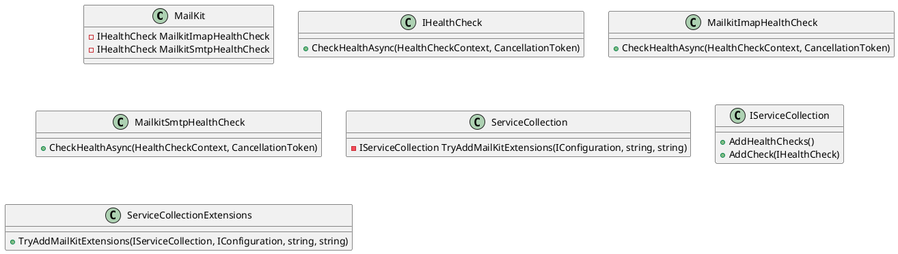

Here is the documentation for the provided source code files:

**MailKit.csproj**

This is a .NET Core project file that defines the MailKit project. The project targets .NET 8.0 and references the following NuGet packages:

* MailKit version 4.3.0
* Microsoft.Extensions.Options version 8.0.2
* Microsoft.Extensions.DependencyInjection.Abstractions version 8.0.1
* Microsoft.Extensions.Logging.Abstractions version 8.0.1
* Microsoft.Extensions.Configuration.Binder version 8.0.2
* Microsoft.Extensions.Diagnostics.HealthChecks version 8.0.7

The project also includes an internal reference to an assembly named "Eliassen.Communications.Abstractions".

**MailkitImapHealthCheck.cs**

This is a health check class that checks the connection status of a MailKit IMAP client. The class implements the `IHealthCheck` interface and has two main methods:

* `Initialize`: Initializes the health check with an instance of `IImapClientFactory`.
* `CheckHealthAsync`: Checks the health of the MailKit IMAP client asynchronously. The method returns a `HealthCheckResult` object indicating the health status of the client.

**MailkitSmtpHealthCheck.cs**

This is a health check class that checks the connection status of a MailKit SMTP client. The class implements the `IHealthCheck` interface and has two main methods:

* `Initialize`: Initializes the health check with an instance of `ISmtpClientFactory`.
* `CheckHealthAsync`: Checks the health of the MailKit SMTP client asynchronously. The method returns a `HealthCheckResult` object indicating the health status of the client.

**Readme.MailKit.md**

This is a Markdown file that provides a summary of the MailKit project. The file includes references to other resources and notes on the project's functionality.

**ServiceCollectionExtensions.cs**

This is a static class that provides extensions for adding MailKit services to the `IServiceCollection`. The class has a single method:

* `TryAddMailKitExtensions`: Tries to add MailKit extensions to the `IServiceCollection`. The method takes four parameters: `services`, `configuration`, `smtpConfigurationSection`, and `imapConfigurationSection`. The method adds health checks, service providers, and configuration options for MailKit SMTP and IMAP clients.

Here is the class diagram for the provided code files:

Note: The class diagram is simplified and does not show all the properties and methods of the classes.