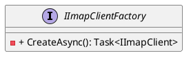
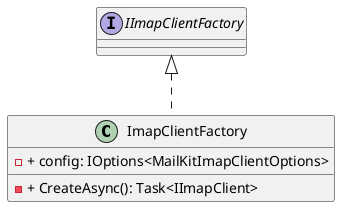
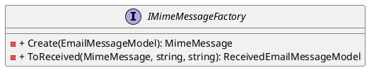
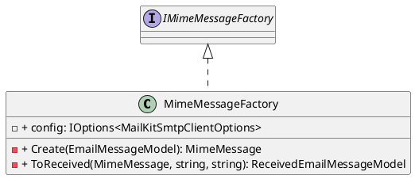

Here is the documentation for the provided source code files, including class diagrams in PlantUML:

**IImapClientFactory.cs**
```
/// <summary>
/// Represents a factory for creating instances of <see cref="ImapClient"/>.
/// </summary>
public interface IImapClientFactory
{
    /// <summary>
    /// Creates a new instance of <see cref="ImapClient"/>.
    /// </summary>
    /// <returns>A task that represents the asynchronous operation and contains the created <see cref="ImapClient"/>.</returns>
    Task<IImapClient> CreateAsync();
}
```
Class Diagram:

**ImapClientFactory.cs**
```
/// <summary>
/// Implementation of <see cref="IImapClientFactory"/> for creating instances of the ImapClient class.
/// </summary>
/// <remark>
/// Initializes a new instance of the <see cref="ImapClientFactory"/> class.
/// </remark>
/// <param name="config">The configuration options for the MailKit Imap client.</param>
public class ImapClientFactory(
    IOptions<MailKitImapClientOptions> config
) : IImapClientFactory
{
    public async Task<IImapClient> CreateAsync()
    {
        // ...
    }
}
```
Class Diagram:

**IMimeMessageFactory.cs**
```
/// <summary>
/// Represents a factory for creating <see cref="MimeMessage"/> instances from <see cref="EmailMessageModel"/>.
/// </summary>
public interface IMimeMessageFactory
{
    /// <summary>
    /// Creates a <see cref="MimeMessage"/> from the specified <see cref="EmailMessageModel"/>.
    /// </summary>
    /// <param name="message">The email message model.</param>
    /// <returns>A <see cref="MimeMessage"/> instance.</returns>
    MimeMessage Create(EmailMessageModel message);

    /// <summary>
    /// Creates a <see cref="ReceivedEmailMessageModel"/> from the specified <see cref="MimeMessage"/>.
    /// and inbound metadata such as host and mailbox path.
    /// </summary>
    /// <param name="message"></param>
    /// <param name="server"></param>
    /// <param name="path"></param>
    /// <returns></returns>
    ReceivedEmailMessageModel ToReceived(MimeMessage message, string server, string path);
}
```
Class Diagram:

**MimeMessageFactory.cs**
```
/// <summary>
/// Implementation of <see cref="IMimeMessageFactory"/> for creating MimeMessage instances for email messages.
/// </summary>
/// <remark>
/// Initializes a new instance of the <see cref="MimeMessageFactory"/> class.
/// </remark>
/// <param name="config">The configuration options for the MailKit SMTP client.</param>
public class MimeMessageFactory(
    IOptions<MailKitSmtpClientOptions> config
) : IMimeMessageFactory
{
    public MimeMessage Create(EmailMessageModel message)
    {
        // ...
    }

    public ReceivedEmailMessageModel ToReceived(MimeMessage message, string server, string path)
    {
        // ...
    }
}
```
Class Diagram:

**ISmtpClientFactory.cs**
```
/// <summary>
/// Represents a factory for creating instances of <see cref="SmtpClient"/>.
/// </summary>
public interface ISmtpClientFactory
{
    /// <summary>
    /// Creates a new instance of <see cref="SmtpClient"/>.
    /// </summary>
    /// <returns>A task that represents the asynchronous operation and contains the created <see cref="SmtpClient"/>.</returns>
    Task<ISmtpClient> CreateAsync();
}
```
Class Diagram:

**SmtpClientFactory.cs**
```
/// <summary>
/// Implementation of