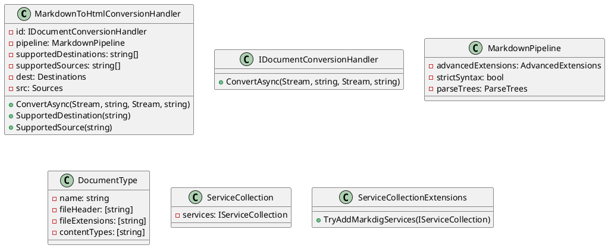

Here is the documentation for the provided source code files:

**Eliassen.Markdig.csproj**

This is a .NET Core project file that defines the Eliassen.Markdig project. It includes the following settings:

* `TargetFramework`: set to `net8.0`
* `ImplicitUsings`: set to `false`
* `Nullable`: set to `enable`
* `GenerateDocumentationFile`: set to `True`
* `GenerateAssemblyInfo`: set to `true`

The project also includes dependencies on the following NuGet packages:

* `Microsoft.Extensions.Configuration.Abstractions`
* `Microsoft.Extensions.DependencyInjection.Abstractions`
* `Microsoft.Extensions.Logging.Abstractions`
* `Microsoft.Extensions.Options.ConfigurationExtensions`
* `Markdig`

**MarkdownToHtmlConversionHandler.cs**

This is a class that converts Markdown documents to HTML format. It implements the `IDocumentConversionHandler` interface and has the following methods:

* `ConvertAsync(Stream, string, Stream, string)`: converts Markdown content from the source stream to HTML format and writes it to the destination stream asynchronously. It throws a `NotSupportedException` if the source or destination content type is not supported.
* `SupportedDestination(string)`: checks if the specified content type is supported for the destination stream.
* `SupportedSource(string)`: checks if the specified content type is supported for the source stream.
* `Destinations`: gets the supported content types for the destination stream.
* `Sources`: gets the supported content types for the source stream.

**Readme.Markdig.md**

This is a Markdown file that documents the Eliassen.Markdig project. It includes information about the `MarkdownToHtmlConversionHandler` class, including its properties and methods.

**ServiceCollectionExtensions.cs**

This is a static class that provides extension methods for configuring services related to Markdig. It includes the following method:

* `TryAddMarkdigServices(IServiceCollection)`: configures services for Markdig. It adds a `MarkdownPipelineBuilder` instance, a `MarkdownToHtmlConversionHandler` instance, and a `DocumentType` instance to the service collection.

Here is the class diagram for the Eliassen.Markdig project in PlantUML:

This diagram shows the relationships between the classes in the Eliassen.Markdig project. The `MarkdownToHtmlConversionHandler` class implements the `IDocumentConversionHandler` interface and uses a `MarkdownPipeline` instance. The `MarkdownPipeline` class references an `AdvancedExtensions` instance, a `bool` for strict syntax, and a `ParseTrees` instance. The `DocumentType` class has properties for name, file header, file extensions, and content types. The `ServiceCollection` class has a property for `services`, and the `ServiceCollectionExtensions` class has a method for adding services related to Markdig.