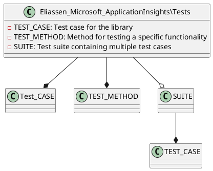

Here is the documentation for the source code file, including a class diagram in PlantUML:

**Project: Eliassen.Microsoft.ApplicationInsights.Tests**

**Description:** This is a test project for the Eliassen.Microsoft.ApplicationInsights library. It contains tests for the classes in the library.

**Class Diagram:**

**File Description:**

This file is a Visual Studio project file that defines a test project for the Eliassen.Microsoft.ApplicationInsights library. The project references other projects, including the Eliassen.Microosft.ApplicationInsights project, which contains the functionality being tested, and the Eliassen.TestUtilities project, which contains utility classes. The project also references some NuGet packages, including Microsoft.NET.Test.SDK and MSTest.TestAdapter.

**Properties:**

* `TargetFramework`: This property specifies the target framework for the project, which is .NET 8.0.
* `ImplicitUsings`: This property specifies whether to use implicit usings or not. In this case, it is set to `false`.
* `Nullable`: This property specifies whether to enable nullable annotations or not. In this case, it is set to `true`.
* `IsPackable`: This property specifies whether the project is packable or not. In this case, it is set to `false`.
* `IsTestProject`: This property specifies whether the project is a test project or not. In this case, it is set to `true`.

**References:**

* `Microsoft.NET.Test.Sdk`: This is a NuGet package that provides support for testing in .NET.
* `MSTest.TestAdapter`: This is a NuGet package that provides the testing adapter for MSTest.
* `MSTest.TestFramework`: This is a NuGet package that provides the testing framework for MSTest.
* `coverlet.collector`: This is a NuGet package that provides the coverlet collector for testing.

**Summary:**

This project file defines a test project for the Eliassen.Microsoft.ApplicationInsights library, which contains tests for the classes in the library. The project references other projects and NuGet packages, and has some specific properties and settings for testing.