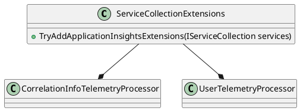

Here is the documentation for the provided source code files:

**Eliassen.Microsoft.ApplicationInsights.csproj**

This is a .NET Core project file that defines the settings and dependencies for the Eliassen.Microsoft.ApplicationInsights assembly.

* Target Framework: .NET 8.0
* Implicit Usings: Disabled
* Nullable Reference Types: Enabled
* Generate Documentation File: True
* Generate Assembly Info: True

The project references the Microsoft.ApplicationInsights, Microsoft.Azure.WebJobs.Logging.ApplicationInsights, and Microsoft.Extensions.DependencyInjection.Abstractions NuGet packages. It also references the Eliassen.System.Abstractions project.

**Readme.Microsoft.ApplicationInsights.md**

This is a README file that provides a summary and notes about the Eliassen.Microsoft.ApplicationInsights assembly.

* Summary: This is a collection of extensions for Microsoft Application Insights to include contextual information.
* Notes:
	+ References to Microsoft documentation on observability with OpenTelemetry, filtering and sampling, and distributed tracing telemetry correlation.

**Class Diagrams in PlantUML**

Here is the class diagram for the Eliassen.Microsoft.ApplicationInsights namespace:

In this diagram, the `ServiceCollectionExtensions` class is the main entry point for configuring Application Insights services. It has a method `TryAddApplicationInsightsExtensions` that returns an `IServiceCollection` object with custom Application Insights telemetry processors added.

**ServiceCollectionExtensions.cs**

This is a C# class file that defines extension methods for configuring Application Insights services.

* The `TryAddApplicationInsightsExtensions` method adds custom Application Insights telemetry processors to the service collection. It returns the modified service collection.
* The `AddApplicationInsightsTelemetryProcessor` method is an extension method that adds a custom Application Insights telemetry processor to the service collection.

Note that the `CorrelationInfoTelemetryProcessor` and `UserTelemetryProcessor` classes are not implemented in this code sample, and are assumed to be part of the Eliassen.System.Abstractions project.