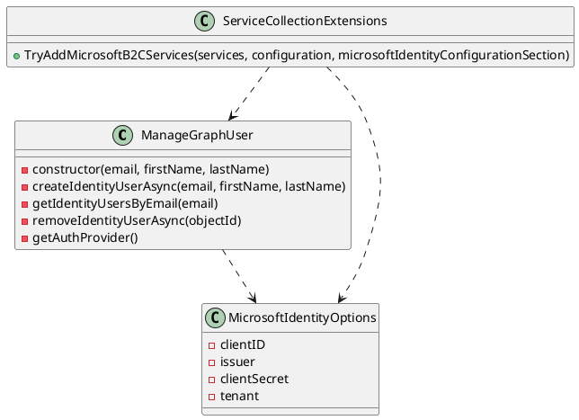

Here is the documentation for the provided source code files.

**Project Documentation**

Project: Eliassen.Microsoft.B2C.csproj
-----------------------------------

This project is a .NET Core library that provides implementations and extensions for integrating with Microsoft Azure Active Directory B2C.

### Class Diagram

Here is a class diagram for the project in PlantUML format:

### Description

The project provides three main components:

1. **ManageGraphUser**: An implementation of the `IIdentityManager` interface for managing users in Microsoft Graph.
2. **MicrosoftIdentityOptions**: A class that contains configuration options for Azure Active Directory B2C.
3. **ServiceCollectionExtensions**: A set of extension methods for adding Microsoft B2C services to the service collection.

### Usage

To use this project, you can import the `Eliassen.Microsoft.B2C` namespace and use the provided classes and methods. For example, you can use the `ManageGraphUser` class to create and manage users in Microsoft Graph, or use the `MicrosoftIdentityOptions` class to configure Azure Active Directory B2C settings.

**Readme.Microsoft.B2C.md Documentation**

# Eliassen.Microsoft.B2C

Eliassen.Microsoft.B2C provides implementations and extensions for integrating with Microsoft Azure Active Directory B2C. Here's an overview of its key components:

## ManageGraphUser

Implementation of `Eliassen.Identity.IIdentityManager` for managing users in Microsoft Graph.

### Methods

- **Constructor**: Initializes a new instance of the class.
- **CreateIdentityUserAsync**: Creates a new identity user asynchronously with the specified email, first name, and last name.
- **GetIdentityUsersByEmail**: Retrieves a list of user identity models based on the provided email address.
- **RemoveIdentityUserAsync**: Removes an identity user asynchronously based on the specified object ID.
- **GetAuthProvider**: Gets the authentication provider for Microsoft Graph.

## MicrosoftIdentityOptions

Contains keys related to Azure Active Directory B2C configuration.

### Properties

- **ClientID**: Represents the key for the Azure AD B2C client ID configuration.
- **Issuer**: Represents the key for the Azure AD B2C issuer configuration.
- **ClientSecret**: Represents the key for the Azure AD B2C client secret configuration.
- **Tenant**: Represents the key for the Azure AD B2C tenant configuration.

## ServiceCollectionExtensions

Extension methods for adding Microsoft B2C services to the service collection.

### Methods

- **TryAddMicrosoftB2CServices**: Adds Microsoft B2C services to the service collection.

**ServiceCollectionExtensions.cs Documentation**

The `ServiceCollectionExtensions` class provides a set of extension methods for adding Microsoft B2C services to the service collection.

### Methods

- **TryAddMicrosoftB2CServices**: Adds Microsoft B2C services to the service collection.

### Parameters

- **services**: The service collection to which Microsoft B2C services should be added.
- **configuration**: The `IConfiguration` instance to use for configuring Microsoft B2C settings.
- **microsoftIdentityConfigurationSection**: The name of the configuration section for Microsoft B2C settings.

### Returns

The modified service collection with Microsoft B2C services added.