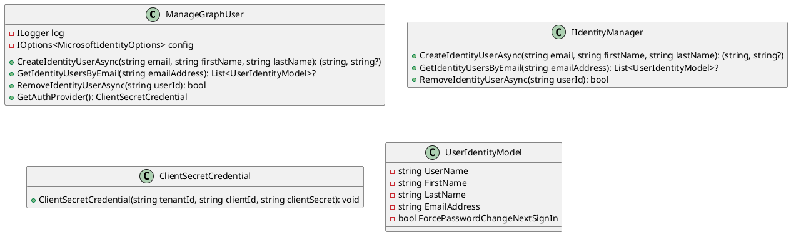
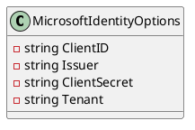

Here is the documentation for the provided source code files, including class diagrams in Plant UML:

**ManageGraphUser Class**

The `ManageGraphUser` class is an implementation of the `IIdentityManager` interface for managing users in Microsoft Graph. It is responsible for creating, retrieving, and removing users in Microsoft Graph.

**Class Diagram:**

**Method Documentation:**

* `CreateIdentityUserAsync`: Creates a new identity user asynchronously with the specified email, first name, and last name.
* `GetIdentityUsersByEmail`: Retrieves a list of user identity models based on the provided email address.
* `RemoveIdentityUserAsync`: Removes an identity user asynchronously based on the specified object ID.
* `GetAuthProvider`: Returns the authentication provider for Microsoft Graph.

**MicrosoftIdentityOptions Class**

The `MicrosoftIdentityOptions` class contains keys related to Azure Active Directory B2C configuration.

**Class Diagram:**

**Property Documentation:**

* `ClientID`: Represents the key for the Azure AD B2C client ID configuration.
* `Issuer`: Represents the key for the Azure AD B2C issuer configuration.
* `ClientSecret`: Represents the key for the Azure AD B2C client secret configuration.
* `Tenant`: Represents the key for the Azure AD B2C tenant configuration.