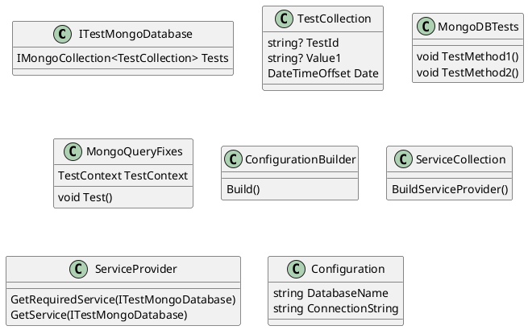

Here is the documentation for the given source code files:

**Eliassen.MongoDB.Tests.csproj**

This is a project file for a .NET Core test project named `Eliassen.MongoDB.Tests`. The project references the `Eliassen.MongoDB` project and the `Eliassen.TestUtilities` project. It also includes references to the `Microsoft.NET.Test.Sdk`, `MSTest.TestAdapter`, `MSTest.TestFramework`, and `coverlet.collector` NuGet packages.

**ITestMongoDatabase.cs**

This is an interface that defines a contract for a MongoDB database. It has a single property `Tests` that returns an instance of `IMongoCollection<TestCollection>`.

**MongoDBTests.cs**

This is a test class that tests the `ITestMongoDatabase` interface. It has two test methods: `TestMethod1` and `TestMethod2`.

`TestMethod1` creates a configuration builder, adds in-memory configuration options, and builds a service provider. It then uses the provider to resolve an instance of `ITestMongoDatabase` and calls various methods on it.

`TestMethod2` is similar to `TestMethod1`, but it uses a different set of configuration options and calls different methods on the `ITestMongoDatabase` instance.

**MongoQueryFixes.cs**

This is a test class that doesn't have any real tests. It has a single test method `Test` that is currently commented out.

**TestCollection.cs**

This is a class that represents a test collection entity. It has three properties: `TestId`, `Value1`, and `Date`. The `TestId` property is annotated with the `[Key]` attribute to indicate that it is the primary key of the collection.

Here is a PlantUML class diagram for the given source code files:

The class diagram shows the relationships between the classes in the `Eliassen.MongoDB.Tests` project. The `ITestMongoDatabase` interface is implemented by the `MongoDBTests` class, which is used to test the `ITestMongoDatabase` interface. The `MongoDBTests` class uses the `ConfigurationBuilder`, `ServiceCollection`, and `ServiceProvider` classes to create a service provider that resolves instances of `ITestMongoDatabase`. The `TestClassCollection` class is a simple data entity class that represents a test collection entity. The `MongoQueryFixes` class is a test class that does not have any real tests.