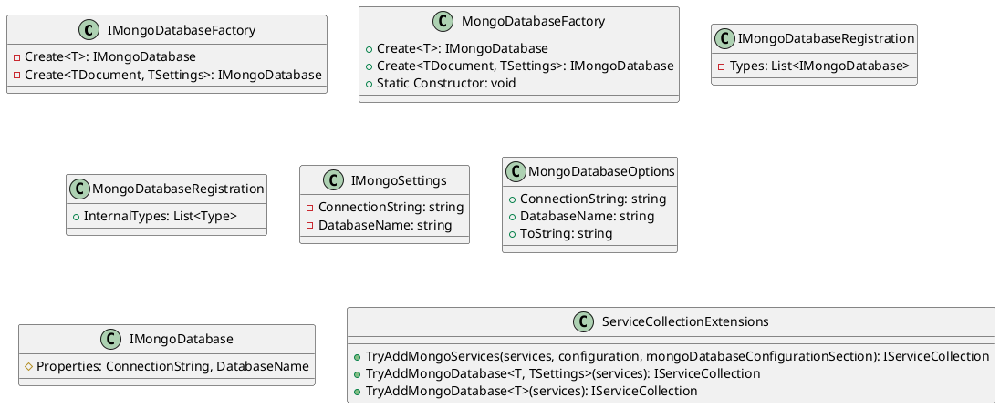

Here is the documentation generated for the given source code files:

**Eliassen.MongoDB.csproj**

This is a .NET Core project file that defines the package and its dependencies. The package, Eliassen.MongoDB, is a library for interacting with MongoDB databases.

**Readme.MongoDB.md**

This is the package's README file, which provides information about the package and its contents. It describes the classes and methods that the package provides.

**IMongoDatabaseFactory**

This is an interface that provides a centralized means to create MongoDB instances. It defines two methods: `Create<T>` and `Create<TDocument, TSettings>`.

**IMongoDatabaseRegistration**

This is an interface that represents a registry for MongoDB database connections. It has one property, `Types`, which is a list of registered interfaces for MongoDB instances.

**IMongoSettings**

This is an interface that defines common settings for MongoDB databases. It has two properties: `ConnectionString` and `DatabaseName`.

**MongoDatabaseFactory**

This is a class that provides a factory for creating MongoDB database instances. It has three methods: `Constructor`, `Create<T>`, `Create<TDocument, TSettings>`, and `Static Constructor`.

**MongoDatabaseOptions**

This is a class that defines default connection information for MongoDB databases. It has two properties: `ConnectionString` and `DatabaseName`, and one method: `ToString`.

**IMongoDatabaseRegistration**

This is a class that represents a registration of types for MongoDB databases. It has one property, `Types`, which is a read-only collection of types registered for MongoDB databases.

**ServiceCollectionExtensions**

This is a static class that provides common libraries to enable MongoDB support. It has three methods: `TryAddMongoServices`, `TryAddMongoDatabase<T>`, and `TryAddMongoDatabase<T>`.

**ServiceCollectionExtensions.cs**

This is the implementation of the `ServiceCollectionExtensions` class. It defines three methods that provide extension methods for the `IServiceCollection` interface.

Here is the PlantUML class diagram for Eliassen.MongoDB:

This class diagram shows the relationships between the classes and interfaces in the Eliassen.MongoDB package. It includes the `IMongoDatabaseFactory` and `MongoDatabaseFactory` classes, which provide a factory for creating MongoDB instances. It also includes the `IMongoDatabaseRegistration` and `MongoDatabaseRegistration` classes, which manage the registration of types for MongoDB databases. The `IMongoSettings` and `MongoDatabaseOptions` classes define common settings for MongoDB databases. The `IMongoDatabase` interface represents a MongoDB database instance. The `ServiceCollectionExtensions` class provides extension methods for the `IServiceCollection` interface.