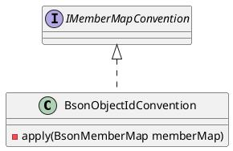
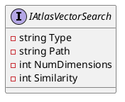
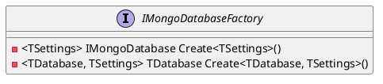
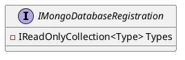
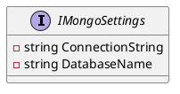
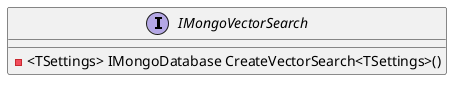
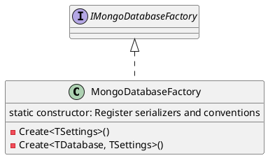
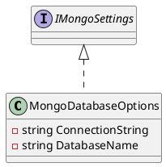
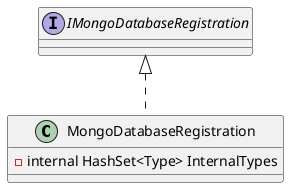
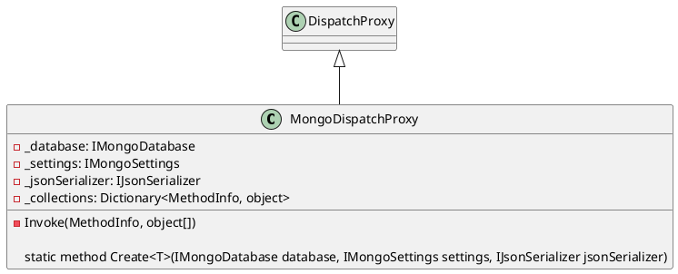

Here is the documentation for the source code files, including class diagrams in PlantUML:

**BsonObjectIdConvention.cs**

* Class: `BsonObjectIdConvention` (`IMemberMapConvention`)
* Summary: Represents a convention for configuring BSON serialization of object IDs.
* Apply method: Modifies the member map to set the type of the object ID property to `ObjectId`.

[PlantUML class diagram]

**IAtlasVectorSearch.cs**

* Interface: `IAtlasVectorSearch`
* Summary: Provides a centralized means to create the index for Atlas Vector Search.
* Properties: `Type`, `Path`, `NumDimensions`, and `Similarity`.

[PlantUML interface diagram]

**IMongoDatabaseFactory.cs**

* Interface: `IMongoDatabaseFactory`
* Summary: Provides a centralized means to create MongoDB instances.
* Methods: `Create<TSettings>()` and `Create<TDatabase, TSettings>()`.

[PlantUML interface diagram]

**IMongoDatabaseRegistration.cs**

* Interface: `IMongoDatabaseRegistration`
* Summary: Internal registry for MongoDatabase connections.
* Property: `Types` (IReadOnlyCollection of Type).

[PlantUML interface diagram]

**IMongoSettings.cs**

* Interface: `IMongoSettings`
* Summary: Common pattern for declaring MongoDB settings.
* Properties: `ConnectionString` and `DatabaseName`.

[PlantUML interface diagram]

**IMongoVectorSearch.cs**

* Interface: `IMongoVectorSearch`
* Summary: Provides a centralized means to create Atlas Vector Search.
* Method: `CreateVectorSearch<TSettings>()`.

[PlantUML interface diagram]

**MongoDatabaseFactory.cs**

* Class: `MongoDatabaseFactory` (`IMongoDatabaseFactory`)
* Summary: Factory for creating MongoDB database instances.
* Methods: `Create<TSettings>()` and `Create<TDatabase, TSettings>()`.
* Static constructor: Registers serializers and conventions.

[PlantUML class diagram]

**MongoDatabaseOptions.cs**

* Class: `MongoDatabaseOptions` (`IMongoSettings`)
* Summary: Default connection information for MongoDB databases.
* Properties: `ConnectionString` and `DatabaseName`.

[PlantUML class diagram]

**MongoDatabaseRegistration.cs**

* Class: `MongoDatabaseRegistration` (`IMongoDatabaseRegistration`)
* Summary: Represents a registration of types for MongoDB databases.
* Property: `InternalTypes` (HashSet of Type).

[PlantUML class diagram]

**MongoDispatchProxy.cs**

* Class: `MongoDispatchProxy` (`DispatchProxy`)
* Summary: This proxy allows for dynamic creation of wrapper classes to expose MongoDatabase instances.
* Fields: `_database`, `_settings`, `_jsonSerializer`, and `_collections`.
* Method: `Invoke(MethodInfo, object[])`.

[PlantUML class diagram]

I hope this helps! Let me know if you have any further requests.