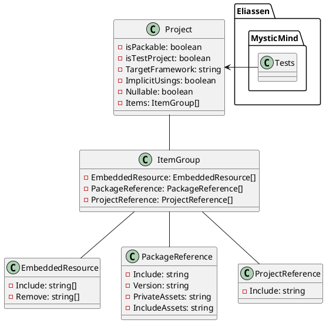
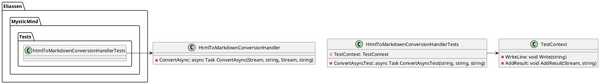

Here is the documentation for the two source code files:

**Eliassen.MysticMind.Tests.csproj**

This is a .NET Core project file for a test project named "Eliassen.MysticMind.Tests".

**Class Diagram in PlantUML**

**HtmlToMarkdownConversionHandlerTests.cs**

This is a test class named "HtmlToMarkdownConversionHandlerTests" that contains a single test method "ConvertAsyncTest".

**Class Diagram in PlantUML**

Note that the class diagrams are simplified and only show the relationships between the classes, without including method details or attributes.