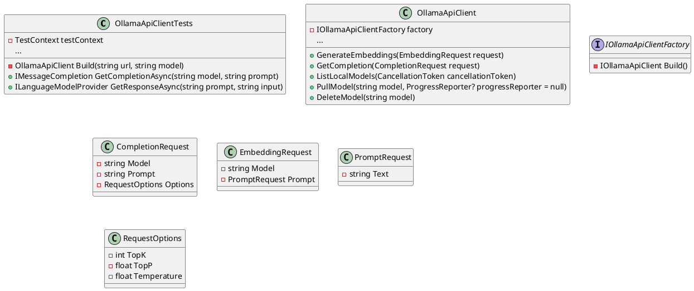
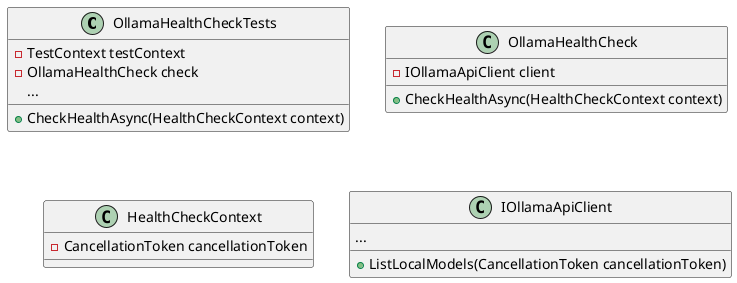
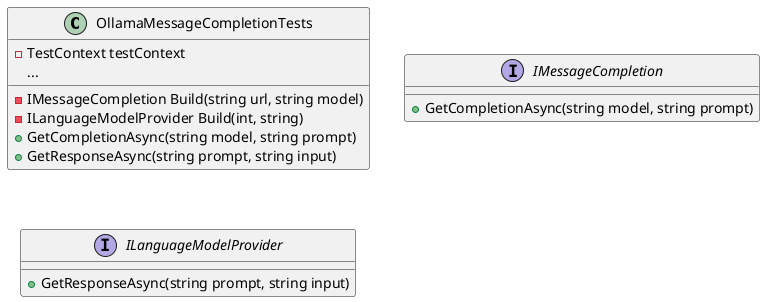

Here is the documentation for the source code files:

**Eliassen.Ollama.Tests.csproj**

This is a .NET Core project file that defines the structure and dependencies of the test project. It specifies the target framework as .NET 8.0 and sets the `ImplicitUsings` to `false`. It also specifies the `Nullable` setting to `enable`.

The project references several NuGet packages, including `coverlet.collector` for code coverage, `Microsoft.NET.Test.Sdk` for test framework, and `MSTest.TestAdapter` and `MSTest.TestFramework` for MSTest testing.

The project also references three project files: `Eliassen.Extensions.csproj`, `Eliassen.TestUtilities.csproj`, and `Eliassen.Ollama.csproj`, which are part of the same solution.

**OllamaApiClientTests.cs**

This is a test class that tests the `OllamaApiClient` class. It uses the `TestContext` class to store test data and results.

The class has several test methods that test various functionalities of the `OllamaApiClient` class, including generating embeddings, getting completions, listing models, pulling models, and deleting models. Each test method uses the `Build` method to create an instance of the `OllamaApiClient` class with a specific URL and model.

The class also uses the `DataTestMethod` attribute to run multiple tests with different inputs.

**Class Diagram:**

**OllamaHealthCheckTests.cs**

This is a test class that tests the `OllamaHealthCheck` class. It uses the `TestContext` class to store test data and results.

The class has two test methods that test the `CheckHealthAsync` method with a healthy and degraded state. Each test method creates an instance of the `HealthCheckContext` class and sets up a mock `IOllamaApiClient` instance to simulate the behavior of the `OllamaApiClient` class.

The class uses the `Moq` library to create mock objects and verify the interactions with the `IOllamaApiClient` instance.

**Class Diagram:**

**OllamaMessageCompletionTests.cs**

This is a test class that tests the `IMessageCompletion` and `ILanguageModelProvider` interfaces. It uses the `TestContext` class to store test data and results.

The class has two test methods that test the `GetCompletionAsync` and `GetResponseAsync` methods of the interfaces. Each test method creates an instance of the interface using the `Build` method and calls the method with a specific input.

**Class Diagram:**

Note: The above diagrams are generated using PlantUML syntax and may need to be adjusted based on the actual code structure and dependencies.