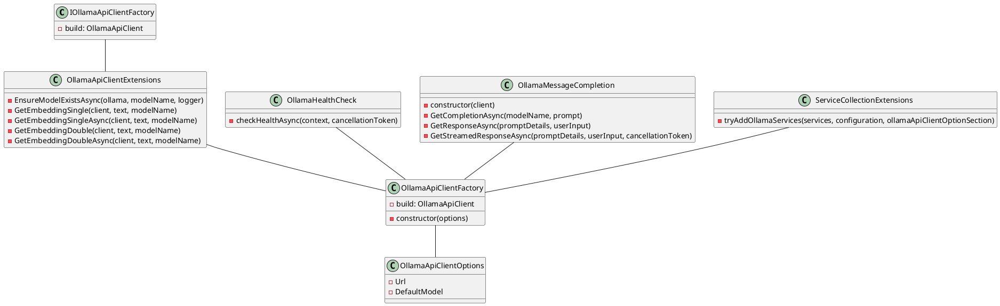

Here is the generated documentation for the provided source code files:

**IOllamaApiClientFactory**

Represents a factory for creating instances of the OllamaApiClient.

* **Build**: Builds an instance of the OllamaApiClient for the specified host.

**OllamaApiClientExtensions**

Provides extension methods for the OllamaApiClient class.

* **EnsureModelExistsAsync(ollama, modelName, logger)**: Ensures that the specified model exists in the Ollama API client.
* **GetEmbeddingSingle(client, text, modelName)**: Retrieves the embedding for the specified text using the specified model synchronously.
* **GetEmbeddingSingleAsync(client, text, modelName)**: Retrieves the embedding for the specified text using the specified model asynchronously.
* **GetEmbeddingDouble(client, text, modelName)**: Retrieves the embedding for the specified text using the specified model synchronously.
* **GetEmbeddingDoubleAsync(client, text, modelName)**: Retrieves the embedding for the specified text using the specified model asynchronously.

**OllamaApiClientFactory**

Factory class for creating instances of the OllamaApiClient.

* **Constructor(options)**: Initializes a new instance of the OllamaApiClientFactory class with the specified options.
* **Build**: Builds a new instance of the OllamaApiClient with the specified host.

**OllamaApiClientOptions**

Represents the configuration options for the Ollama API client.

* **Url**: Gets or initializes the URL of the Ollama API.
* **DefaultModel**: Gets or initializes the default model to use with the Ollama API.

**OllamaHealthCheck**

Represents a health check implementation for the Ollama service.

* **CheckHealthAsync(context, cancellationToken)**: Checks the health of the Ollama service asynchronously.

**OllamaMessageCompletion**

Responsible for generating message completions using the Ollama API.

* **Constructor(client)**: Initializes a new instance of the OllamaMessageCompletion class.
* **GetCompletionAsync(modelName, prompt)**: Generates a completion for the given prompt using the specified model asynchronously.
* **GetResponseAsync(promptDetails, userInput)**: Retrieves a response from the language model based on the provided prompt details and user input asynchronously.
* **GetStreamedResponseAsync(promptDetails, userInput, cancellationToken)**: Gets a streamed response asynchronously based on the provided prompt details and user input.

**ServiceCollectionExtensions**

Provides extension methods for configuring services related to Ollama.

* **TryAddOllamaServices(services, configuration, ollamaApiClientOptionSection)**: Configures services for Ollama.

Here is the PlantUML class diagram for the provided source code files:

Note: The class diagram is not exhaustive, as it only includes the classes and interfaces mentioned in the provided source code files.