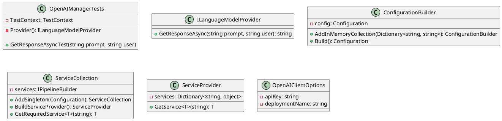

Here is the documentation for the OpenAIManagerTests.cs file, including a class diagram in PlantUML:

**Class Diagram:**

**Description:**
The `OpenAIManagerTests` class is a test class that tests the `OpenAIManager` class, which is not provided in this code example. The class uses the `ILanguageModelProvider` interface to get a response from the OpenAI API.

The `Provider` method creates an instance of `ILanguageModelProvider` using the `ConfigurationBuilder` and `ServiceCollection` classes. The `GetResponseAsync` method of `ILanguageModelProvider` is then called with a prompt and user input to get a response from the OpenAI API.

The `GetResponseAsyncTest` method tests the `GetResponseAsync` method by calling it with different prompts and user inputs, and verifying that the response is not null or empty.

**Test Methods:**
The `GetResponseAsyncTest` method is a data-driven test that takes three input parameters: `prompt`, `user`, and `expectedResult`. The method calls the `GetResponseAsync` method with the provided `prompt` and `user` inputs, and then asserts that the result is equal to the `expectedResult`.

**Test Categories:**
The `GetResponseAsyncTest` method is marked with the `TestCategory` attribute and the `DevLocal` test category. This means that the test will only be executed when running the tests in the `DevLocal` environment.

**Data-Driven Test:**
The `GetResponseAsyncTest` method is also marked with the `DataTestMethod` attribute and the `DataRow` attribute. This means that the test will be executed multiple times with different input parameters, as specified in the `DataTestMethod` attribute.

I hope this documentation helps! Let me know if you have any questions or need further clarification.