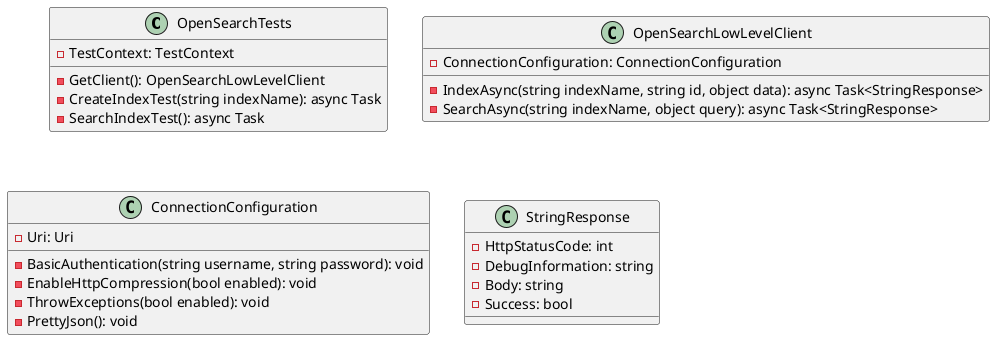

Here is the generated documentation for the provided source code files:

**Eliassen.OpenSearch.Tests.csproj**

* This is a .NET Core project file for a test project.
* The project targets .NET 8.0 and uses the Microsoft.NET.Sdk.
* The project contains several package references, including Coverlet.Collector, Microsoft.NET.Test.Sdk, MSTest.TestAdapter, and MSTest.TestFramework.
* The project also contains a few project references to other projects in the solution.
* The `IsTestProject` property is set to `true`, indicating that this is a test project.

**Class Diagram**

Here is the PlantUML code for the class diagram:

**OpenSearchTests.cs**

* This class contains two test methods: `CreateIndexTest` and `SearchIndexTest`.
* Both methods use the `GetClient` method to create an instance of the `OpenSearchLowLevelClient` class.
* The `CreateIndexTest` method creates a new index and adds a document to it, with a test that checks the HTTP status code, debug information, and body of the response.
* The `SearchIndexTest` method searches for documents in the index with a query, with a test that checks the HTTP status code, debug information, and body of the response.
* The `GetClient` method returns an instance of the `OpenSearchLowLevelClient` class, with a connection configuration that includes basic authentication, HTTP compression, and throwing exceptions.

**Method Documentation**

Here is the method documentation for the `CreateIndexTest` and `SearchIndexTest` methods:

* `CreateIndexTest(string indexName)`: Creates a new index and adds a document to it.
* `SearchIndexTest()`: Searches for documents in the index with a query.