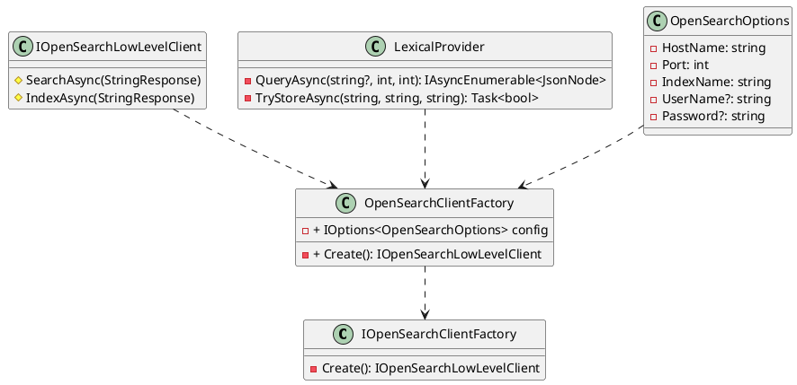

**Class Diagram in PlantUML**

**Documentation**

**IOpenSearchClientFactory**

Interface for creating instances of the `IOpenSearchLowLevelClient`.

* `Create(): IOpenSearchLowLevelClient` - Creates a new instance of the `OpenSearchLowLevelClient`.

**OpenSearchClientFactory**

Implementation of the `IOpenSearchClientFactory` interface.

* `Create(): IOpenSearchLowLevelClient` - Creates a new instance of the `OpenSearchLowLevelClient`.
* `config: IOptions<OpenSearchOptions>` - Configuration options for the OpenSearch client.

**LexicalProvider**

Provides functionality for storing and searching lexical content using OpenSearch.

* `QueryAsync(string?, int, int): IAsyncEnumerable<JsonNode>` - Queries the OpenSearch index for lexical content matching the specified query string.
* `TryStoreAsync(string, string, string): Task<bool>` - Stores the content in the OpenSearch index if it doesn't already exist.

**OpenSearchOptions**

Configuration options for the OpenSearch client.

* `HostName: string` - Hostname of the OpenSearch server.
* `Port: int` - Port number of the OpenSearch server.
* `IndexName: string` - Index name used for OpenSearch operations.
* `UserName?: string` - Username for authentication (if required).
* `Password?: string` - Password for authentication (if required).

**ServiceCollectionExtensions**

Provides extension methods for configuring services related to OpenSearch.

* `TryAddOpenSearchServices(IServiceCollection, IConfiguration, string): IServiceCollection` - Configures services for OpenSearch.

**Usage**

To use the classes and interfaces in this package, create an instance of the `OpenSearchClientFactory` and use its `Create()` method to get an instance of the `IOpenSearchLowLevelClient`. You can then use this client to perform OpenSearch operations, such as querying and storing content.