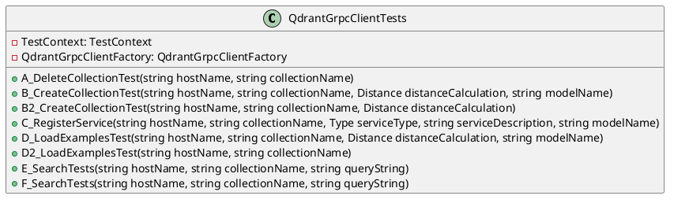

Here is the documentation for the provided source code files.

**QdrantGrpcClientTests.cs**

### Class Diagram

### Description

The `QdrantGrpcClientTests` class contains a set of tests for the Qdrant gRPC client. The tests cover various scenarios, including creating and deleting collections, registering services, loading examples, and searching for points.

### Methods

* `A_DeleteCollectionTest`: Tests deleting a collection.
* `B_CreateCollectionTest`: Tests creating a collection with a specified distance calculation and model name.
* `B2_CreateCollectionTest`: Tests creating a collection with a specified distance calculation.
* `C_RegisterService`: Tests registering a service.
* `D_LoadExamplesTest`: Tests loading examples into a collection.
* `D2_LoadExamplesTest`: Tests loading examples into a collection using the SBertClient.
* `E_SearchTests`: Tests searching for points using a single query.
* `F_SearchTests`: Tests searching for points using grouping.

### Data Members

* `TestContext`: The test context for the tests.
* `QdrantGrpcClientFactory`: The factory for creating Qdrant gRPC clients.

### Constructors

* None

**Eliassen.Qdrant.Tests.csproj**

This is a Visual Studio project file that defines the build settings and dependencies for the `QdrantGrpcClientTests` class.

### Properties

* `TargetFramework`: Set to `net8.0`.
* `ImplicitUsings`: Set to `false`.
* `Nullable`: Set to `enable`.
* `IsPackable`: Set to `false`.
* `IsTestProject`: Set to `true`.

### Items

* `PackageReference`: Includes the `coverlet.collector`, `Microsoft.NET.Test.Sdk`, `MSTest.TestAdapter`, and `MSTest.TestFramework` packages.
* `ProjectReference`: References the `Eliassen.Qdrant` project.