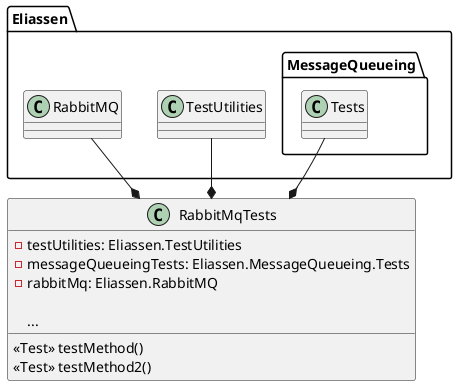

Here is the documentation for the `Eliassen.RabbitMQ.Tests` project in Markdown format, including a class diagram in PlantUML:

**Project Overview**

The `Eliassen.RabbitMQ.Tests` project is a unit test project for the `Eliassen.RabbitMQ` assembly. It is used to verify the functionality of the rabbitMQ classes against a set of test cases.

**Dependency Overview**

The project has the following dependencies:

* `Microsoft.NET.Test.Sdk` (version 17.10.0): A testing framework for .NET projects
* `MSTest.TestAdapter` (version 3.4.3): A testing adapter for MSTest tests
* `MSTest.TestFramework` (version 3.4.3): A testing framework for MSTest tests
* `coverlet.collector` (version 6.0.2): A code coverage tool
* `Eliassen.MessageQueueing.Tests` (project reference): A project reference to the `Eliassen.MessageQueueing.Tests` project
* `Eliassen.RabbitMQ` (project reference): A project reference to the `Eliassen.RabbitMQ` project
* `Eliassen.TestUtilities` (project reference): A project reference to the `Eliassen.TestUtilities` project

**Class Diagram**

Here is a class diagram for the project using PlantUML:

**Test Class Overview**

The `RabbitMqTests` class contains a set of test methods that verify the functionality of the `Eliassen.RabbitMQ` classes. The class uses the `Eliassen.TestUtilities` and `Eliassen.MessageQueueing.Tests` projects for utilities and test cases, respectively.

**Note**: This documentation only covers the `Eliassen.RabbitMQ.Tests` project and does not include documentation for the dependent projects.

I hope this helps! Let me know if you have any questions or need further clarification.