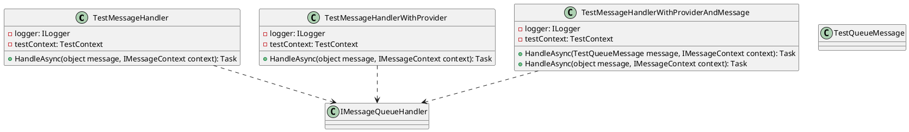

Here is the documentation for the source code files, including class diagrams in PlantUML:

**Class Diagrams**

**Documentation**

### TestMessageHandler

The `TestMessageHandler` class is a test message handler that implements the `IMessageQueueHandler` interface. It takes two parameters in its constructor: `ILogger` and `TestContext`. The `ILogger` parameter is used to log information, and the `TestContext` parameter is used to store the test results.

The `HandleAsync` method is responsible for handling the message. It logs the message and adds it to the test context with a unique file name.

### TestMessageHandlerWithProvider

The `TestMessageHandlerWithProvider` class is a test message handler that implements the `IMessageQueueHandler` interface with the `RabbitMQQueueMessageSenderProviderTests` provider. It takes two parameters in its constructor: `ILogger` and `TestContext`. The `ILogger` parameter is used to log information, and the `TestContext` parameter is used to store the test results.

The `HandleAsync` method is responsible for handling the message. It logs the message and adds it to the test context with a unique file name.

### TestMessageHandlerWithProviderAndMessage

The `TestMessageHandlerWithProviderAndMessage` class is a test message handler that implements the `IMessageQueueHandler` interface with the `RabbitMQQueueMessageSenderProviderTests` provider and the `TestQueueMessage` type. It takes two parameters in its constructor: `ILogger` and `TestContext`. The `ILogger` parameter is used to log information, and the `TestContext` parameter is used to store the test results.

The `HandleAsync` method is responsible for handling the message. It logs the message and adds it to the test context with a unique file name. The method also handles messages of the `TestQueueMessage` type specifically.

### TestQueueMessage

The `TestQueueMessage` class is a simple record that represents a test queue message.

### Interfaces

* `IMessageQueueHandler`: An interface that defines the `HandleAsync` method for handling messages.
* `ILogger`: An interface that defines the `LogInformation` method for logging information.

Note: The above documentation assumes that the `RabbitMQQueueMessageSenderProviderTests` class and the `IMessageContext` interface are defined elsewhere in the codebase.