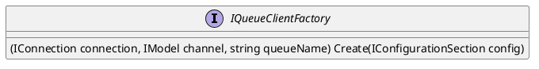

Here is the documentation for the provided source code files, including class diagrams in PlantUML:

**IQueueClientFactory.cs**

* **Interface: IQueueClientFactory**
	+ Summary: Factory for creating instances of IConnection and IModel for Rabbit MQ Queues.
	+ Methods:
		- Create(IConfigurationSection config): Creates a new instance of IConnection and IModel based on the provided configuration section.

Class Diagram (PlantUML):


**QueueClientFactory.cs**

* **Class: QueueClientFactory**
	+ Summary: Factory for creating instances of IConnection and IModel for Rabbit MQ Queues.
	+ Methods:
		- Create(IConfigurationSection config): Creates a new instance of IConnection and IModel based on the provided configuration section.
	+ Implementations:
		- Creates a new instance of ConnectionFactory based on the provided configuration.
		- Creates a new instance of IConnection and IModel using the created ConnectionFactory.

Class Diagram (PlantUML):
```plantuml
@startuml
class QueueClientFactory implements IQueueClientFactory {
  -ConnectionFactory factory
  -IConnection connection
  -IModel channel
  -string queueName

  QueueClientFactory() {
    factory = new ConnectionFactory();
  }

  (IConnection connection, IModel channel, string queueName) Create(IConfigurationSection config) {
    // code implementation
  }
}

interface IQueueClientFactory {
  (IConnection connection, IModel channel, string queueName) Create(IConfigurationSection config)
}

@enduml
```

**RabbitMQQueueMessageProvider.cs**

* **Class: RabbitMQQueueMessageProvider**
	+ Summary: Provides functionality for sending and receiving messages using Rabbit MQ Queues.
	+ Constructors:
		- RabbitMQQueueMessageProvider(IJsonSerializer serializer, IQueueClientFactory clientFactory, ILogger<RabbitMQQueueMessageProvider> logger)
	+ Methods:
		- SendAsync(object message, IMessageContext context): Sends a message asynchronously to an Rabbit MQ Queue.
		- SetHandlerProvider(IMessageHandlerProvider handlerProvider): Sets the message handler provider for processing received messages.
		- RunAsync(CancellationToken cancellationToken = default): Runs the message receiver asynchronously, continuously listening for incoming messages.
	+ Implementations:
		- Sends a message using the provided configuration and message context.
		- Sets the message handler provider for processing received messages.
		- Runs the message receiver using the provided configuration and cancellation token.

Class Diagram (PlantUML):
```plantuml
@startuml
class RabbitMQQueueMessageProvider implements IMessageSenderProvider, IMessageReceiverProvider {
  -IJsonSerializer serializer
  -IQueueClientFactory clientFactory
  -ILogger logger
  -IMessageHandlerProvider? _handlerProvider

  RabbitMQQueueMessageProvider(IJsonSerializer serializer, IQueueClientFactory clientFactory, ILogger logger) {
    // code implementation
  }

  async Task<string?> SendAsync(object message, IMessageContext context) {
    // code implementation
  }

  IMessageReceiverProvider SetHandlerProvider(IMessageHandlerProvider handlerProvider) {
    _handlerProvider = handlerProvider;
    return this;
  }

  async Task RunAsync(CancellationToken cancellationToken = default) {
    // code implementation
  }
}

interface IMessageSenderProvider {
  Task<string?> SendAsync(object message, IMessageContext context)
}

interface IMessageReceiverProvider {
  IMessageReceiverProvider SetHandlerProvider(IMessageHandlerProvider handlerProvider)
  Task RunAsync(CancellationToken cancellationToken = default)
}

@enduml
```

Note: The PlantUML diagrams are simplified and do not include all the details of the classes and interfaces. They are meant to provide a high-level overview of the relationships between the classes and interfaces.