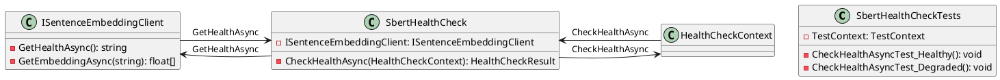

Here is the documentation for the provided source code files:

**Eliassen.SBert.Tests.csproj**

This is a .NET Core project file for a test project called `Eliassen.SBert.Tests`. It is configured to use .NET 8.0 as the target framework and uses the `Microsoft.NET.Sdk` SDK. The project is set to be non-packable and is marked as a test project.

The project references several NuGet packages:

* `coverlet.collector` version 6.0.2
* `Microsoft.NET.Test.Sdk` version 17.10.0
* `MSTest.TestAdapter` version 3.4.3
* `MSTest.TestFramework` version 3.4.3

The project also references two project files:

* `..\..\..\Framework\Eliassen.TestUtilities\Eliassen.TestUtilities.csproj`
* `..\Eliassen.SBert\Eliassen.SBert.csproj`

**SbertHealthCheckTests.cs**

This is a .NET Core test class called `SbertHealthCheckTests`. It contains two test methods:

1. `CheckHealthAsyncTest_Healthy()`: Tests the `SbertHealthCheck` class when the health check is healthy.
2. `CheckHealthAsyncTest_Degraded()`: Tests the `SbertHealthCheck` class when the health check is degraded.

The class uses dependency injection to create a mock `ISentenceEmbeddingClient` instance. It then uses the `SbertHealthCheck` class to perform the health check and verifies the results.

**SentenceEmbeddingClientTests.cs**

This is a .NET Core test class called `SentenceEmbeddingClientTests`. It contains two test methods:

1. `GetEmbeddingAsyncTest(string url, string message)`: Tests the `GetEmbeddingAsync` method of the `ISentenceEmbeddingClient` interface with a specific URL and message.
2. `GetAllTest(string url)`: Tests the `GetEmbeddingAsync` method of the `ISentenceEmbeddingClient` interface with a specific URL and a list of sentences.

The class uses dependency injection to create a `ISentenceEmbeddingClient` instance with a specific URL. It then uses the `GetEmbeddingAsync` method to retrieve the embedding for the provided sentences and verifies the results.

**Class Diagrams**

Here is a PlantUML class diagram for the `SbertHealthCheckTests` class:

Here is a PlantUML class diagram for the `SentenceEmbeddingClientTests` class:
```plantuml
@startuml
class SentenceEmbeddingClientTests {
  - TestContext: TestContext
  - GetEmbeddingAsyncTest(string, string): void
  - GetAllTest(string): void
}

class SentenceEmbeddingClient {
  - GetEmbeddingAsync(string): float[]
  - GetEmbeddingDoubleAsync(string): double[]
}

class ISentenceEmbeddingClient {
  - GetEmbeddingAsync(string): float[]
  - GetEmbeddingDoubleAsync(string): double[]
}

SentenceEmbeddingClient -interface> ISentenceEmbeddingClient
SentenceEmbeddingClient -left-> SentenceEmbeddingClientTests : GetEmbeddingAsync
SentenceEmbeddingClient -left-> SentenceEmbeddingClientTests : GetAll
@enduml
```
Note that the class diagrams are simplified and do not show all the details of the classes and interfaces.