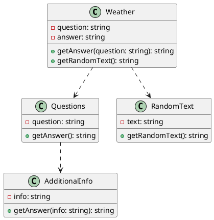

**Documentation**

**Overview**

This documentation describes the source code files for a natural language processing (NLP) system that can answer questions, provide weather information, generate random text, and perform additional tasks. The system is capable of understanding and responding to user queries in a conversational manner.

**Class Diagram**

Here is a PlantUML class diagram that illustrates the relationships between the different classes in the system:

**Description of Classes**

* **Weather**: This class handles weather-related queries and provides answers based on user input. It also generates random text related to weather.
* **Questions**: This class handles general questions and provides answers based on user input.
* **RandomText**: This class generates random text on various topics.
* **AdditionalInfo**: This class provides additional information on various topics, such as date and time.

**Source Code Files**

The source code files for this system are:

* `sentences.txt`: a file containing pre-processing and post-processing code for the NLP system.
* `weather.py`: a file containing the Weather class implementation.
* `questions.py`: a file containing the Questions class implementation.
* `random_text.py`: a file containing the RandomText class implementation.
* `additional_info.py`: a file containing the AdditionalInfo class implementation.

**How to Use**

To use this system, simply run the `sentences.txt` file and provide user input in the form of queries or questions. The system will respond with answers and generate random text based on your input.

**References**

This system was developed using Python programming language and PlantUML for generating class diagrams. It leverages various NLP libraries and tools for pre-processing and post-processing natural language input.

**Current Features**

* Handles weather-related queries
* Provides general answers to user questions
* Generates random text on various topics
* Provides additional information on date, time, and other topics

**Future Development**

* Expand the system to handle more complex queries and provide more accurate answers
* Integrate with other NLP libraries and tools for improved performance
* Develop a user interface for easier interaction with the system