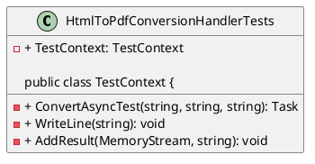

Here is the generated documentation for the source code files:

**Eliassen.WkHtmlToPdf.Tests.csproj**

This is a .NET Core project file for testing the `Eliassen.WkHtmlToPdf` library.

**Properties**

* `TargetFramework`: The target framework for the project, set to `net8.0`.
* `ImplicitUsings`: Set to `false` to disable implicit usings.
* `Nullable`: Set to `enable` to enable nullable references.
* `IsPackable`: Set to `false` to disable packable projects.
* `IsTestProject`: Set to `true` to indicate that this is a test project.

**Package References**

* `coverlet.collector`: A package for collecting code coverage data.
* `Microsoft.NET.Test.Sdk`: A package for running .NET tests.
* `MSTest.TestAdapter`: A package for running MSTest tests.
* `MSTest.TestFramework`: A package for writing MSTest tests.
* `Eliassen.TestUtilities`: A package for utility classes.

**Project References**

* `Eliassen.TestUtilities`: A project reference to the `Eliassen.TestUtilities` project.
* `Eliassen.WkHtmlToPdf`: A project reference to the `Eliassen.WkHtmlToPdf` project.

**Class Diagram**

Here is a PlantUML class diagram for the `Eliassen.WkHtmlToPdf.Tests` project:

**HtmlToPdfConversionHandlerTests.cs**

This is a test class for the `HtmlToPdfConversionHandler` class.

**Methods**

* `ConvertAsyncTest(string, string, string)`: Tests the `ConvertAsync` method of the `HtmlToPdfConversionHandler` class.

**Parameters**

* `resourceName`: The name of the resource file to test.
* `sourceType`: The type of the source file.
* `targetType`: The type of the target file.

**Dependencies**

* `Eliassen.TestUtilities`: A utility class for testing.
* `Microsoft.Extensions.DependencyInjection`: A package for dependency injection.
* `Microsoft.Extensions.Logging`: A package for logging.
* `Microsoft.VisualStudio.TestTools.UnitTesting`: A package for unit testing.

**Class Diagram**

Here is a PlantUML class diagram for the `HtmlToPdfConversionHandlerTests` class:
```plantuml
@startuml
class HtmlToPdfConversionHandlerTests {
  -+ TestContext: TestContext
  -+ ConvertAsyncTest(string, string, string): Task

  public class TestContext {
    -+ WriteLine(string): void
    -+ AddResult(MemoryStream, string): void
  }

  public class HtmlToPdfConversionHandler {
    -+ ConvertAsync(MemoryStream, string, MemoryStream, string): Task
  }
}
@enduml
```
I hope this helps! Let me know if you have any further requests.