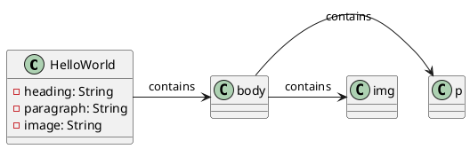

**Documentation for HelloWorld.html**

**Introduction:**
The HelloWorld.html file is an HTML document that displays a "Hello World!" heading, a paragraph of text, and an image encoded in base64.

**Class Diagram:**
The class diagram for HelloWorld.html is depicted below in PlantUML:

**Class Description:**
The `HelloWorld` class represents the HTML document. It has three properties: `heading`, `paragraph`, and `image`, which correspond to the HTML elements `<h1>`, `
`, and `` respectively.

**Methods:**

* None (since this is an HTML document and not a program)

**Properties:**

* `heading`: a String that contains the text "Hello World!"
* `paragraph`: a String that contains the text "this is a test!"
* `image`: a String that contains the base64-encoded image data

**HTML Structure:**
The HTML structure of the document can be described as follows:

* `<html>`: the root element of the document
* `<head>`: contains metadata about the document
* `<body>`: contains the content of the document
	+ `<h1>`: displays the heading "Hello World!"
	+ `
`: displays the paragraph "this is a test!"
	+ ``: displays the image encoded in base64

**Conclusion:**
This documentation provides an overview of the HelloWorld.html file, its class diagram, and its properties and structure.