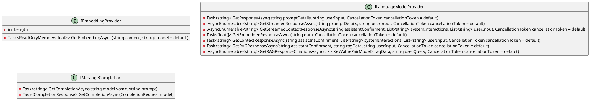
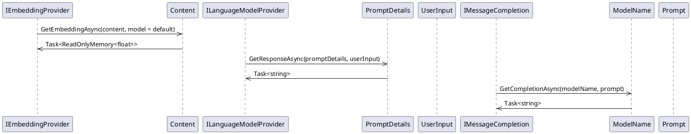

# Eliassen.AI.Abstractions Documentation

This documentation provides an overview of the `Eliassen.AI` namespace, which contains abstract definitions for interfacing with ML/AI such as sentence embeddings and language models.

## Class Diagram

## Component Model

The `Eliassen.AI` namespace consists of three main components:

1. `IEmbeddingProvider`: Provides interfaces for working with word embeddings.
2. `ILanguageModelProvider`: Provides interfaces for working with language models.
3. `IMessageCompletion`: Provides interfaces for working with message completion.

## Sequence Diagram

## Class Descriptions

### IEmbeddingProvider

Represents a provider for word embeddings.

* `Length`: Retrieves the length of the embeddings.
* `GetEmbeddingAsync(content)`: Retrieves the embedding vector for the given content. Takes `content` as input and returns an array of single-precision floats representing the embedding vector.

### ILanguageModelProvider

Represents a provider for a language model.

* `GetResponseAsync(promptDetails, userInput)`: Retrieves a response from the language model based on provided prompt details and user input. Takes `prompt details` and `user input` as inputs and returns a response from the language model.
* `GetStreamedResponseAsync(promptDetails, userInput)`: Retrieves a streamed response from the language model based on provided prompt details and user input. Takes `prompt details` and `user input` as inputs and returns an asynchronous enumerable of strings representing the streamed response.
* `GetStreamedContextResponseAsync(assistantConfinment, systemInteractions, userInput)`: Retrieves a streamed response from the language model based on provided assistant confinment, system interactions, and user input. Takes `assistant confinment`, `system interactions`, and `user input` as inputs and returns an asynchronous enumerable of strings representing the streamed response.
* `GetEmbeddedResponseAsync(data)`: Retrieves a response from the language model based on provided data. Takes `data` as input and returns a float array representing the response.

### IMessageCompletion

Represents a provider for message completion.

* `GetCompletionAsync(modelName, prompt)`: Retrieves a completion for the given prompt from the specified model. Takes `model name` and `prompt` as inputs and returns a completion for the prompt.
* `GetCompletionAsync(model)`: Retrieves a completion for the given model. Takes `model` as input and returns a `CompletionResponse` object.

### KeyValuePairModel

Represents a key-value pair model.

### CompletionResponse

Represents a completion response object.

### CompletionRequest

Represents a completion request model.