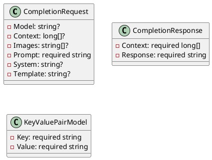
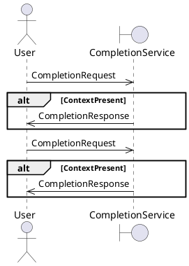

Here is the documentation for the source code in Markdown format, along with the requested PlantUML diagrams:

## Introduction

This documentation provides details on the source code for a project consisting of three C# classes: `CompletionRequest`, `CompletionResponse`, and `KeyValuePairModel`. These classes are used to represent requests and responses for a completion process, as well as a base model for key-value pairs.

## Class Diagram

## Class Descriptions

### `CompletionRequest`

The `CompletionRequest` class represents a completion request. It has the following properties:

* `Model`: a string that represents the model for the completion request
* `Context`: a long array that represents the context for the completion request
* `Images`: a string array that represents the images for the completion request
* `Prompt`: a required string that represents the prompt for the completion request
* `System`: a string that represents the system for the completion request
* `Template`: a string that represents the template for the completion request

### `CompletionResponse`

The `CompletionResponse` class represents a completion response. It has the following properties:

* `Context`: a required long array that represents the context for the completion response
* `Response`: a required string that represents the response generated by the completion process

### `KeyValuePairModel`

The `KeyValuePairModel` class is a base model for key-value pairs. It has the following properties:

* `Key`: a required string that represents the key
* `Value`: a required string that represents the value

## Sequence Diagram

## Sequence Description

The sequence diagram shows the interaction between a user and a completion service. The user sends a completion request to the service, which processes the request and sends a response back to the user. The completion service checks if the context is present and sends a response accordingly.

I hope this documentation meets your requirements! Let me know if you need any further assistance.