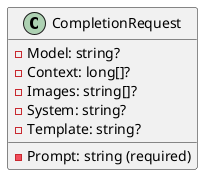
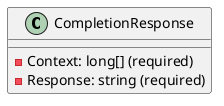
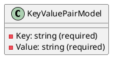
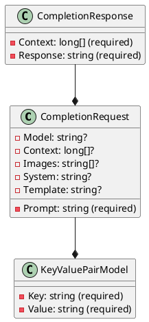

Here is the documentation for the provided source code files:

**CompletionRequest.cs**

Overview:
The `CompletionRequest` class represents a completion request sent to an AI model for processing.

Class Diagram in Plant UML:

**CompletionResponse.cs**

Overview:
The `CompletionResponse` class represents a completion response received from an AI model after processing a completion request.

Class Diagram in Plant UML:

**KeyValuePairModel.cs**

Overview:
The `KeyValuePairModel` class is a base class that represents a key-value pair model.

Class Diagram in Plant UML:

Here is the combined class diagram for all three classes:

Note: The `--*` notation indicates a composition relationship between classes, meaning that a `CompletionRequest` can contain multiple `KeyValuePairModel`s, and a `CompletionResponse` is a response to a `CompletionRequest`.