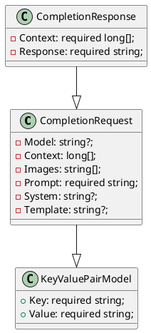

**README File**

This repository contains three source files: `CompletionRequest.cs`, `CompletionResponse.cs`, and `KeyValuePairModel.cs`. These files define the data models used in a natural language processing (NLP) system for text completion.

**Summary**

The `CompletionRequest` class represents a request to generate a completion for a given prompt. It contains properties for the model, context, images, prompt, system, and template used to generate the completion. The `CompletionResponse` class represents the response generated by the completion process, containing the context and the generated response. The `KeyValuePairModel` class is a base class that represents a key-value pair.

**Technical Summary**

The `CompletionRequest` and `CompletionResponse` classes demonstrate the use of value records in C# to create immutable objects. This design allows for efficient and thread-safe creation and manipulation of objects. The `KeyValuePairModel` class follows the Singleton design pattern, where a single instance of the class is created and shared throughout the system.

**Component Diagram**

Here is a component diagram generated using PlantUML:

This diagram illustrates the relationships between the classes, showing that `CompletionRequest` inherits from `KeyValuePairModel` and `CompletionResponse` is related to `CompletionRequest`.