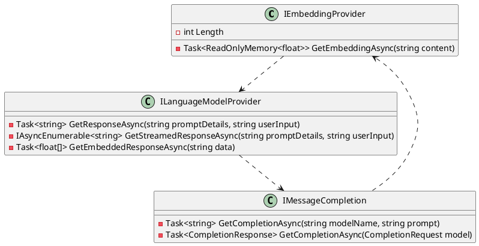

**README File: Eliassen.AI.Abstractions**

**Summary**
----------------

The Eliassen.AI.Abstractions library is a collection of interfaces that define the abstract definitions for interfacing with machine learning (ML) and artificial intelligence (AI) models. Specifically, this library contains three key interfaces:

1. `IEmbeddingProvider`: represents a provider for word embeddings, allowing for the retrieval of embedding vectors for given content.
2. `ILanguageModelProvider`: represents a provider for a language model, enabling the retrieval of responses to user input and prompt details.
3. **IMessageCompletion**: represents a provider for message completion, allowing for the retrieval of completions for given prompts.

These interfaces provide a foundation for developing applications that leverage ML/AI models, enabling developers to integrate these models seamlessly into their systems.

**Technical Summary**
--------------------

**Design Patterns and Architectural Patterns**

* The `IEmbeddingProvider` interface exhibits the Factory Method pattern, as it provides a standardized way to retrieve embedding vectors from various models.
* The `ILanguageModelProvider` interface demonstrates the Strategy pattern, as it allows for the selection of different language models to generate responses.
* The `IMessageCompletion` interface shows the Template Method pattern, as it provides a framework for generating completions based on specific models.

**Component Diagram (PlantUML)**
-----------------------------

This component diagram illustrates the relationships between the three interfaces, highlighting how they interact and depend on each other.