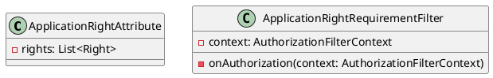
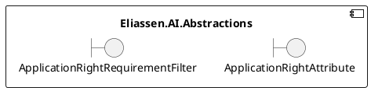
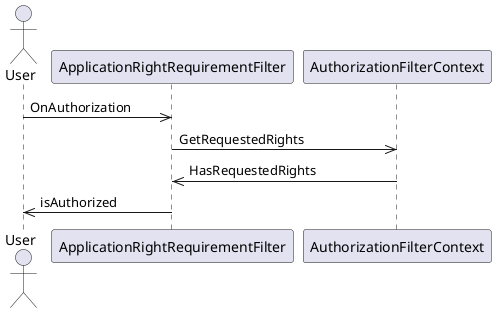

Here is the documentation for the source code in Markdown format:

**Introduction**
===============

This documentation provides an overview of the Eliassen.AI.Abstractions library, which contains abstract definitions for ASP.Net Core Extensions.

**Class Diagram**

**Component Model**

**Sequence Diagram**

