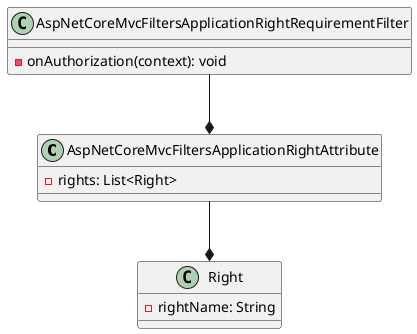

Here is the documentation for the provided source code files, including class diagrams using PlantUML:

**Project Documentation**

* **Eliassen.AI.Abstractions.csproj**: This project is an ASP.NET Core library that defines abstract interfaces and classes for various purposes.
* **Target Framework:** .NET 8.0
* **Generated Documentation File:** Tru

**Class Diagram**

**Class Descriptions**

* **AspNetCoreMvcFiltersApplicationRightAttribute**: Represents an attribute that specifies the required rights for accessing an endpoint. It contains a list of `Right` objects.
* **AspNetCoreMvcFiltersApplicationRightRequirementFilter**: Represents an authorization filter that compares application rights for a user to the rights required by an endpoint. It has a single method `onAuthorization(context)` that ensures the current authenticated user possesses at least one of the requested rights.
* **Right**: Represents a single right that can be required for accessing an endpoint. It has a single property `rightName` that specifies the name of the right.

**Notes**

The Eliassen.AI.Abstractions library provides a way to define and enforce application rights for accessing endpoints in ASP.NET Core applications. The `AspNetCoreMvcFiltersApplicationRightAttribute` and `AspNetCoreMvcFiltersApplicationRightRequirementFilter` classes work together to implement this functionality.

**Readme File**

* **Readme.AspNetCore.Abstractions.md**: This file provides a brief summary and notes about the Eliassen.AI.Abstractions library.
* **Summary**: This library contains the abstract definitions for ASP.Net Core Extensions.
* **Notes**: The document describes the Eliassen.AspNetCore.Abstractions namespace, which includes two classes: `AspNetCore.Mvc.Filters.ApplicationRightAttribute` and `AspNetCore.Mvc.Filters.ApplicationRightRequirementFilter`.

Please let me know if you would like me to make any changes or additions to this documentation!