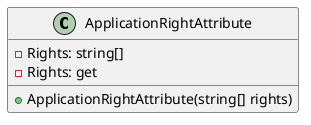
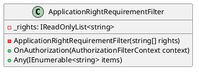

**ApplicationRightAttribute.cs Documentation**

### Class Diagram (PlantUML)

### Description

The `ApplicationRightAttribute` class is a custom attribute used to declare required application rights for an endpoint. It inherits from `TypeFilterAttribute` and uses the `ApplicationRightRequirementFilter` filter to enforce the required rights.

### Constructor

The constructor takes a variable number of strings representing the required application rights. The `Rights` property is set to this list of strings.

### Properties

* `Rights`: Gets the list of required application rights.

### Summary

At least one of these declared rights must be assigned to the user to access this point.

**ApplicationRightRequirementFilter.cs Documentation**

### Class Diagram (PlantUML)

### Description

The `ApplicationRightRequirementFilter` class is an authorization filter that ensures the current authenticated user has at least one of the required application rights.

### Constructor

The constructor takes an array of strings representing the required application rights. The `_rights` property is set to this list of strings.

### Methods

* `OnAuthorization(AuthorizationFilterContext context)`: Ensures that the current authenticated user matches at least one requested right. If the user is not authenticated or does not have the required rights, a `ForbidResult` is returned.
* `Any(IEnumerable<string> items)`: Checks if any of the items in the provided collection match the required rights.

### Summary

Authorization filter to compared application rights for user to rights required by endpoint.

Note: The `AuthorizationFilterContext` class is not shown in the class diagram as it is from the `Microsoft.AspNetCore.Mvc.Filters` namespace and is not part of the provided code.