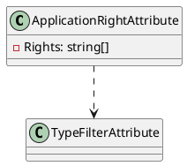
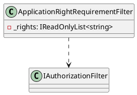
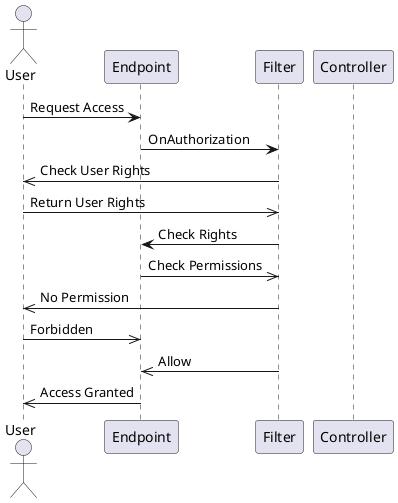

Here is the documentation for the provided source code:

**ApplicationRightAttribute**

### Overview

The `ApplicationRightAttribute` is a custom attribute used in ASP.NET Core web applications to declare the required rights for an endpoint. This attribute ensures that at least one of the declared rights is assigned to the user to access the endpoint.

### Syntax

```csharp
[ApplicationRightAttribute("right1", "right2", ...)]
public class MyController : Controller
{
    // Controller methods
}
```

### Properties

* `Rights`: A list of required rights for the endpoint.

### Constructors

* `ApplicationRightAttribute(params string[] rights)`: Declares the required rights for the endpoint.

### Diagrams



**ApplicationRightRequirementFilter**

### Overview

The `ApplicationRightRequirementFilter` is an authorization filter that compares the application rights of the current user to the rights required by an endpoint.

### Syntax

```csharp
[ApplicationRightRequirementFilter("right1", "right2", ...)]
public class MyController : Controller
{
    // Controller methods
}
```

### Properties

* `_rights`: A list of required rights for the endpoint.

### Methods

* `OnAuthorization(AuthorizationFilterContext context)`: Ensures that the current authenticated user matches at least one of the requested rights.

### Diagrams



**Sequence Diagram**



This sequence diagram illustrates the interaction between the user, the endpoint, the filter, and the controller. It shows how the filter checks the user's rights and returns the result to the endpoint, which then decides whether to grant or deny access.