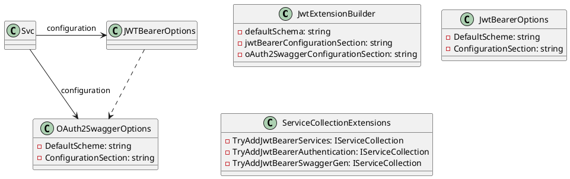

**Eliassen.AspNetCore.JwtAuthentication Package Documentation**

**Summary**
This package provides extension methods for configuring JWT Bearer authentication and SwaggerGen services in ASP.NET Core.

**Getting Started**

To use this package, follow these steps:

1. Add a reference to the `Eliassen.AspNetCore.JwtAuthentication` package in your project.
2. Add the following namespaces to your IOC registation code:
```csharp
using Eliassen.AspNetCore.JwtAuthentication;
using Microsoft.Extensions.Configuration;
using Microsoft.Extensions.DependencyInjection;
```
3. Configure your JWT Bearer authentication and SwaggerGen services in your `IServiceCollection` using the extension methods:
```csharp
public void ConfigureServices(IServiceCollection services)
{
    services.TryAddJwtBearerServices(configuration);
}
```
where `configuration` is your `IConfiguration` instance.

**Configuration**

The JWT Bearer authentication configuration is specified in the `JwtBearerOptions` class. The OAuth2SwaggerOptions class specifies the configuration for SwaggerGen services for OAuth2.

The configuration for JWT Bearer authentication is specified in the `jwtBearerConfigurationSection` parameter of the `TryAddJwtBearerAuthentication` method. The configuration for SwaggerGen services for OAuth2 is specified in the `oAuth2SwaggerConfigurationSection` parameter of the `TryAddJwtBearerSwaggerGen` method.

**Example**

Here is an example of how to use the extension methods to configure JWT Bearer authentication and SwaggerGen services in an ASP.NET Core 8.0 project:
```csharp
public void ConfigureServices(IServiceCollection services)
{
    services.AddControllers();

    services.TryAddJwtBearerServices(configuration);

    services.AddSwaggerGen(c =>
    {
        c.SwaggerDoc("v1", new OpenApiInfo { Title = "My API", Version = "v1" });
    });
}
```
This code adds the JWT Bearer authentication and SwaggerGen services to the `IServiceCollection` using the `TryAddJwtBearerServices` method. It also adds a Swagger documentation for an API with version 1.

**Class Diagrams**



**Notes**

* The `JwtExtensionBuilder` class is a builder for configuring JWT extensions.
* The `JwtBearerOptions` class represents the configuration for JWT Bearer authentication.
* The `OAuth2SwaggerOptions` class represents the configuration for SwaggerGen services for OAuth2.
* The `ServiceCollectionExtensions` class provides extension methods for configuring JWT Bearer authentication and SwaggerGen services in `IServiceCollection`.
* The `TryAddJwtBearerServices` method adds JWT Bearer authentication and SwaggerGen services to the `IServiceCollection`.
* The `TryAddJwtBearerAuthentication` method adds JWT Bearer authentication services to the `IServiceCollection`.
* The `TryAddJwtBearerSwaggerGen` method adds SwaggerGen services for OAuth2 to the `IServiceCollection`.