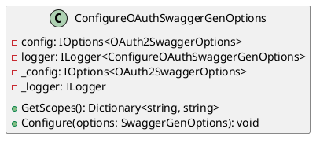
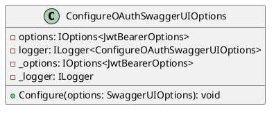
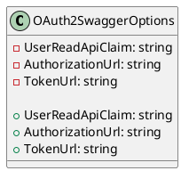

Here is the documentation for the provided source code files, including class diagrams in PlantUML:

**ConfigureOAuthSwaggerGenOptions.cs**

* **Class Diagram (in PlantUML)**

* **Class Description**: `ConfigureOAuthSwaggerGenOptions` is a class that configures SwaggerGen options for OAuth2 authentication.
* **Methods**: `GetScopes` returns a dictionary of OAuth2 scopes, and `Configure` configures the SwaggerGen options to use OAuth2 authentication.

**ConfigureOAuthSwaggerUIOptions.cs**

* **Class Diagram (in PlantUML)**

* **Class Description**: `ConfigureOAuthSwaggerUIOptions` is a class that configures SwaggerUI options for OAuth authentication.
* **Methods**: `Configure` configures the SwaggerUI options to use OAuth authentication.

**OAuth2SwaggerOptions.cs**

* **Class Diagram (in PlantUML)**

* **Class Description**: `OAuth2SwaggerOptions` is a class that represents the options for configuring OAuth2 in Swagger.
* **Properties**: `UserReadApiClaim` specifies the claim that Swagger will use to determine the authenticated user's API access, `AuthorizationUrl` specifies the URL for the authorization endpoint, and `TokenUrl` specifies the URL for the token endpoint.

 Please note that the PlantUML diagrams are a simplified representation of the classes and their relationships.